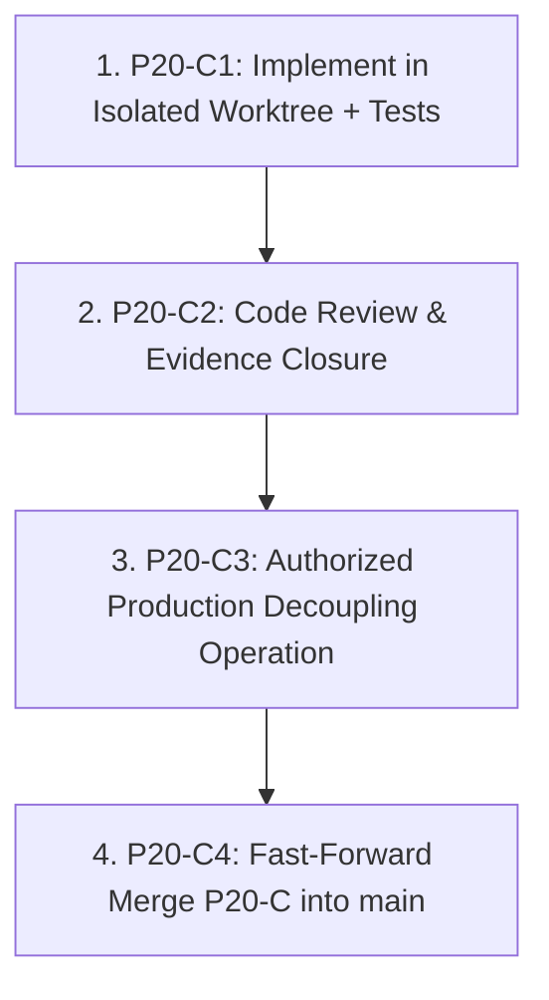

# OMEGA Production Deployment Operations Guide (P20-C)

---

## 1. Architectural Principle

$$\text{SOURCE MERGE} \ne \text{PRODUCTION CODE DEPLOYMENT} \ne \text{DATABASE MIGRATION} \ne \text{FEATURE ACTIVATION}$$

Merging code to `main` must never automatically alter running production container filesystems or execute database schema migrations.

---

## 2. Era 1: Transition Era (Current Production Decoupling)

Currently, shared containers bind-mount `backend -> /app` and `omega-api` runs `uvicorn --reload` with `AUTO_MIGRATE=true`.
To prevent premature deployment upon merging P20-C, the following transition workflow is strictly required:



### P20-C3 Decoupling Procedure (requires separate authorization):
Before any command, verify the exact existing Compose project, networks, and
volume mappings and inspect the effective target configuration. Preserve existing
PostgreSQL data volumes; never create a new database as a side effect of decoupling.
Run this procedure only after C2 approval and separate C3 authorization.
1. **Create and verify an isolated base checkout**:
   Never build the C3 runtime from the P20-C feature worktree or from the repository root
   after its ref changes. Create a detached checkout at the full approved commit and verify it:
   ```bash
   git worktree add --detach /tmp/OmegaContentEngine-p20-c3-base 1ec61e14c01e84becd303119ef7546d0af15e5ed
   test "$(git -C /tmp/OmegaContentEngine-p20-c3-base rev-parse HEAD)" = "1ec61e14c01e84becd303119ef7546d0af15e5ed"
   ```
2. **Build and identify the immutable base image**:
   Build only from that verified checkout. Record the resulting image ID before cutover:
   ```bash
   docker build -t omega:1ec61e14c01e84becd303119ef7546d0af15e5ed /tmp/OmegaContentEngine-p20-c3-base/backend
   docker image inspect omega:1ec61e14c01e84becd303119ef7546d0af15e5ed --format '{{.Id}}'
   ```
3. **Switch Shared Production to Immutable Compose**:
   Use the reviewed P20-C2 `docker-compose.prod.yml` only as topology configuration and set
   `OMEGA_IMAGE=omega:1ec61e14c01e84becd303119ef7546d0af15e5ed`. The application image itself
   must be the verified base image above. Do not build from, mount, or deploy P20-C feature
   source. Inspect `docker compose config` and verify that the existing PostgreSQL volume is
   preserved before any recreate.
   Verify:
   - Zero host bind mounts to `/app`.
   - `AUTO_MIGRATE=false`.
   - `uvicorn --workers 1` (no `--reload`).
   - Feature gates remain `false`.
   - No migration command is run; revision 026 remains undeployed and DB stays at 025.
   - The running application image ID equals the recorded base image ID.
4. **Verify Operational Health**:
   Verify database remains revision 025, `pipeline_analytics_rollups` remains absent, and
   `/health` returns 200. The base runtime does not expose P20-C `/health/live`, `/metrics`,
   or `/ops/status`; their absence during C3 is expected and proves feature code was not deployed.
5. **Authorize Merge (P20-C4)**:
   Fast-forward merge P20-C into `main` and push. Production containers remain on immutable image `1ec61e14` without hot-reloading code.

---

## 3. Era 2: Future Decoupled Production Deployments

Once production is decoupled from the host filesystem, standard deployments follow this deterministic 8-step sequence:

### Step 1: Merge Source
Fast-forward merge approved, reviewed branch into `main`.

### Step 2: Build & Tag Immutable Image
Build container image tagged with immutable commit SHA:
```bash
docker build -t omega:<commit_sha> ./backend
```

### Step 3: Database Pre-Deployment Snapshot
Execute logical backup before any release action:
```bash
docker exec omega-postgres pg_dump -U omega -d omega -F c -f /var/lib/postgresql/data/backup_<timestamp>.dump
```

### Step 4: Standalone Migration Execution (If Approved)
If schema revision advance is approved, run migration as a dedicated, ephemeral container:
```bash
docker compose -p omegacontentengine -f docker-compose.prod.yml run --rm --no-deps omega-api alembic upgrade <approved_target_rev>
```

### Step 5: Deploy Immutable Containers
Deploy updated images using `docker-compose.prod.yml`:
```bash
IMAGE_TAG=<commit_sha> docker compose -p omegacontentengine -f docker-compose.prod.yml up -d
```

### Step 6: Verify Feature Gates Remain OFF
Confirm all new feature gates default to `false` in the running environment.

### Step 7: Readiness Observation
Check `/health/ready` and `/ops/status` to confirm core health is `READY` (HTTP 200).

### Step 8: Controlled Staged Gate Activation
Independently activate feature gates in environment configuration, monitoring logs and Prometheus metrics at each step.

## Observability timing
`OBSERVABILITY_DB_COLLECTOR_CACHE_TTL_SECONDS=5` is CONFIGURABLE_UNTUNED.
Health probe limits and Beat freshness thresholds are also CONFIGURABLE_UNTUNED.
DB metrics are non-authoritative snapshots. A failed source retains its last
snapshot with source_up=0; operators must not interpret stale zero values as proof.
Worker and Beat container health probes inspect local processes only. Beat loop
freshness is a separate tick signal and may degrade during broker outages.
Production images exclude tests, scripts, credentials, backups, media and scratch.
Tests must be mounted separately into disposable isolated test containers.
