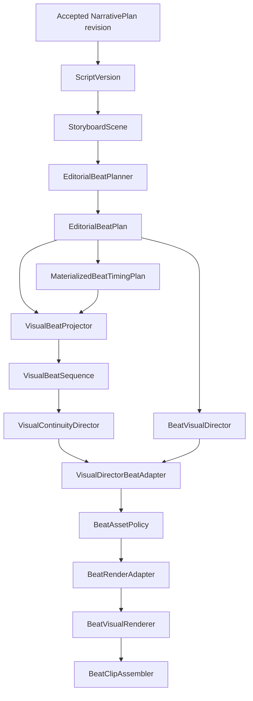

# P22-A Visual Beat Authority and Continuity Architecture

## Authority model

P22-A uses `EDITORIAL_TO_VISUAL`. `EditorialBeatSpec` and `VisualBeat` are not peer authorities:

- `EditorialBeatPlanner` is the only component that creates semantic/editorial beat units and the only component that allocates their physical timing.
- `EditorialBeatSpec` is the canonical semantic unit: narration span, source statement references, semantic role, visual-strategy intent, asset-reuse intent, motion intent, and transition intent.
- `VisualBeatProjector` does not split narration or allocate timing. It projects `EditorialBeatPlan` plus `MaterializedBeatTimingPlan` into continuity-aware `VisualBeat` intervals.
- `VisualBeat` is a derived visual enrichment: visual role, information goal, motif, reuse policy, overlay intent, and continuity decision.

The planner at `omega.application.editorial_beat_planner.EditorialBeatPlanner` is the single canonical planner. There is no second `EditorialBeatPlanner` in the continuity module.

## Canonical pipeline



`CanonicalBeatPreparationService` executes this path. The continuity adapter adds continuity metadata to the canonical `BeatVisualDirector` output; it does not independently select a competing render mode, template, semantic role, camera intent, transition intent, or asset requirement.

`VisualDirector.resolve(scene)` remains the legacy scene-level API. `VisualDirector.resolve_beat(scene, visual_beat)` remains a compatibility view for callers that only need a standard `VisualDirection`; it is not the final beat-render direction authority. The renderer path uses the enriched `BeatVisualDirection` produced from the canonical `BeatVisualDirector` result.

## Lineage and timing

Every projected interval records `VisualBeat.source_editorial_beat_indices`. These indices are copied directly from `EditorialBeatTiming.source_beat_indices`.

This is intentionally plural. The canonical timing allocator can merge short editorial beats into one materialized interval. In that case, one `VisualBeat` contains all contributing editorial indices, the ordered union of their source statement references, and their ordered narration spans. The projector never invents fallback offsets for editorial beats merged out of the timing plan.

The trace is therefore deterministic:

```text
VisualBeat
  -> EditorialBeatSpec index/indices
  -> StoryboardScene and source statement references
  -> ScriptVersion
  -> accepted NarrativePlan revision
```

Visual beat UUIDs are deterministically derived from scene identity, source editorial indices, and narration. No database persistence or migration is required for this derived lineage.

Merged timing remains an explicit renderer eligibility boundary: `BeatRenderAdapter` returns `MERGED_BEAT_TIMING_UNSUPPORTED` rather than silently fabricating a one-to-one render plan. One-to-one materialized beats flow through `BeatVisualRenderer` and `BeatClipAssembler`, which support multiple ordered visual states within one parent scene.

## Visual continuity responsibilities

`VisualContinuityDirector` operates only after projection. It may assign:

- continuity decisions such as `KEEP`, `REUSE`, `RETURN_TO_MOTIF`, `PROGRESS_DOCUMENT`, `PROGRESS_DIAGRAM`, or `SWITCH_CONTEXT`;
- asset reuse policies such as `CONTINUITY_ANCHOR`, `INTENTIONAL_REUSE`, `CONCEPTUAL_VARIATION`, `CALLBACK_VISUAL`, or `NEW_ACQUISITION`;
- diagnostics for visual churn, overly long holds, accidental repetition, document context loss, comparison side swaps, and missing progression.

It does not change editorial segmentation, narration authority, or timing.

## Visual direction handoff

`BeatVisualDirector` remains the canonical beat-direction mapper. It resolves the editorial strategy and semantic role into render mode, template, asset requirements, layout, motion intent, and hard-cut transition intent.

For one-to-one renderable intervals, `VisualDirectorBeatAdapter.enrich_beat_visual_direction` verifies the visual beat points to the supplied editorial beat and then adds continuity metadata to that canonical direction. `BeatRenderAdapter` converts the result into the standard `VisualDirection` view consumed by existing template/render code.

This produces one renderer handoff rather than parallel final-direction paths.

## Pacing terminology

The canonical pacing values are:

```text
FAST
BALANCED
DELIBERATE
```

Legacy input `RELAXED` is accepted only as a deterministic compatibility alias for `DELIBERATE`; it is not a fourth pacing mode.

## P22-A boundaries

P22-A defines semantic projection, continuity policy, lineage, and the existing renderer handoff. It does not implement camera or transition execution, diagram/chart rendering, audio, publishing, or deployment.

P22-B may consume P22-A timing boundaries and `REFRAME_LATER` intent to add camera paths, pan/zoom, Ken Burns, parallax, motion easing, match cuts, or animated transitions. None of those behaviors are executed by P22-A.

P22-C may consume `DIAGRAM` and `DATA` roles for actual diagram/chart rendering. P22-D may consume continuity findings for visual editorial QA.

`P22A_SCHEMA_CHANGE_REQUIRED = NO`; the architecture uses derived in-memory models and requires no migration 028.
