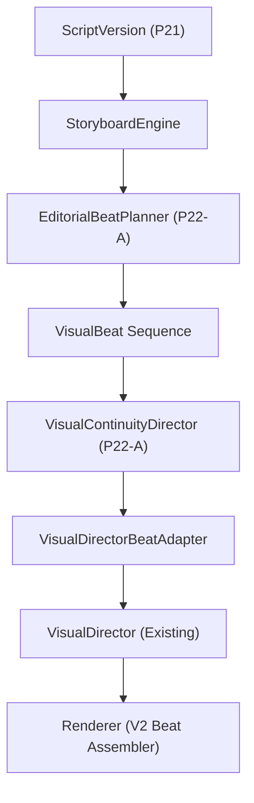

# P22-A Visual Continuity & Editorial Beat Architecture

## 1. Architectural Overview

P22-A introduces editorial visual continuity and typed beat planning between `Storyboard` and `VisualDirector`/renderer.

P22-A answers:
- **WHAT should visually change during a scene?** Informational beats derived from factual claims, transitions, and explanation milestones.
- **WHAT visual information should persist across beats?** Continuity motifs, primary documents, and stable comparison frames.
- **WHEN should an asset be reused versus replaced?** Explicit `AssetReusePolicy` governing intentional reuse, continuity anchors, callbacks, and avoiding accidental repeats.
- **HOW should adjacent visual beats remain semantically coherent?** Directed by `VisualContinuityDirector` with typed continuity decisions.

---

## 2. Core Domain Models

### EditorialBeat / VisualBeat
A typed domain model (`omega.domain.visual_beat.VisualBeat`) representing an editorial visual beat within a parent `StoryboardScene`:
- `id`: Unique UUID identifier.
- `scene_id` & `parent_scene_index`: Identifies the parent Storyboard scene.
- `beat_index`: 0-indexed position within the scene.
- `start_offset_ms` & `end_offset_ms` & `duration_ms`: Timeline slice relative to scene start.
- `narrative_section_role`: Semantic role inherited from `NarrativePlan`.
- `script_statement_ids`: Source statement lineage references.
- `narration_text`: Verbatim narration span.
- `visual_intent` & `information_goal`: What the viewer sees and what point is delivered.
- `visual_role`: Editorial purpose classification (`VisualRole`).
- `continuity_group_id`: Explicit motif or continuity group identifier.
- `preferred_asset_type`: Target asset category (`IMAGE`, `BROLL`, `SCREENSHOT`, `DIAGRAM`, `DATA_CARD`, `DOCUMENT`).
- `asset_reuse_policy`: Explicit reuse semantics (`AssetReusePolicy`).
- `text_overlay_intent`: Proposed graphic or stat callout.
- `grounding_references`: Verified claim citations backing the beat.
- `importance`: Editorial weight.
- `continuity_decision`: Continuity decision relative to previous beat (`ContinuityDecisionType`).

### VisualRole Taxonomy
Typed taxonomy classifying WHY visual content exists:
- `ESTABLISH`: Hook and atmospheric baseline setup.
- `EXPLAIN`: Core conceptual explanation.
- `EVIDENCE`: Factual proof backing claims.
- `COMPARE`: Evaluation of two opposing entities/approaches.
- `EMPHASIZE`: High-impact verbal or visual emphasis.
- `REVEAL`: Thematic payoff or surprising insight.
- `CONTEXTUALIZE`: Environmental or background setting.
- `DOCUMENT`: Inspection of primary documents, whitepapers, or SEC filings.
- `DATA`: Quantitative metrics and statistical proof points.
- `DIAGRAM`: System architecture, protocol flow, or mechanism illustration.
- `BROLL`: Ambient cutaway footage.
- `QUOTE`: Direct testimony or excerpt.
- `SUMMARY`: Synthesis of takeaways.
- `CTA`: Viewer call to action.

### Continuity Decisions (`ContinuityDecisionType`)
Directives between adjacent visual beats:
- `KEEP`: Continue current visual subject with no state change.
- `REUSE`: Intentionally preserve existing visual asset for deeper explanation.
- `REFRAME_LATER`: Maintain visual anchor with intent for camera reframing in P22-B.
- `REPLACE`: Contextual shift requiring a fresh visual asset.
- `RETURN_TO_MOTIF`: Deliberate return to an earlier established motif anchor.
- `PROGRESS_DOCUMENT`: Advance deeper into a primary document (Overview → Section → Detail).
- `PROGRESS_DIAGRAM`: Advance diagram explanation by revealing subsequent stages.
- `SWITCH_CONTEXT`: Transition to an unrelated subject or scene.

---

## 3. Continuity Policies & Tracking

### Asset Reuse Policy (`AssetReusePolicy`)
Distinguishes intentional continuity from accidental repetition:
- `INTENTIONAL_REUSE`: Asset deliberately maintained across adjacent beats.
- `ACCIDENTAL_REPEAT`: Same asset or query repeated across disparate topics without motif justification (detected and flagged).
- `CONCEPTUAL_VARIATION`: Same conceptual entity illustrated from an alternate angle or representation.
- `CONTINUITY_ANCHOR`: Primary asset established as the visual anchor for a motif.
- `CALLBACK_VISUAL`: Explicit callback to an earlier scene's visual asset.
- `NEW_ACQUISITION`: Fresh external asset required.

### Motif & Continuity Groups (`ContinuityGroup`)
Inspectable continuity motifs binding related visual beats across the video:
- Types: `ENTITY`, `MAP`, `DOCUMENT`, `DIAGRAM`, `COMPARISON`.
- Tracks `primary_subject`, `active_section_orders`, and `anchor_asset_id`.

### Document & Evidence Continuity (`DocumentContinuityState`)
Preserves document identity and governs four-stage semantic progression:
1. `OVERVIEW`: Broad document establishment (title, cover, layout).
2. `SECTION`: Specific page or chapter focus.
3. `DETAIL`: Highlighted sentence, data table, or quote clause.
4. `RETURN_TO_CONTEXT`: Return to general narrative context.

Jumping directly to `DETAIL` without establishing `OVERVIEW` triggers `DOCUMENT_CONTEXT_LOST`.

### Comparison Continuity (`ComparisonContinuityState`)
Maintains stable spatial assignments across comparative beats:
- `entity_a` mapped to `ComparisonSide.LEFT`.
- `entity_b` mapped to `ComparisonSide.RIGHT`.
- Inverting entity sides across adjacent beats triggers `COMPARISON_SIDE_SWAP`.

---

## 4. Diagnostics & Continuity Findings

Structured finding codes emitted by `BeatDurationPolicy` and `VisualContinuityDirector`:
- `BROKEN_SUBJECT_CONTINUITY`: Unjustified context jump during continuous subject explanation.
- `ACCIDENTAL_ASSET_REPEAT`: Unmotivated asset duplication across unrelated topics.
- `EXCESSIVE_VISUAL_HOLD`: Visual state held longer than policy allows without progression.
- `EXCESSIVE_VISUAL_CHURN`: Three or more consecutive cuts under 2000ms.
- `MISSING_VISUAL_PROGRESS`: Three or more consecutive beats with identical role and subject without informational progress.
- `COMPARISON_SIDE_SWAP`: Semantic sides inverted in a comparison frame.
- `DOCUMENT_CONTEXT_LOST`: Premature detail zoom without document overview.
- `MOTIF_DRIFT`: Motif ID reused for conflicting subject matter.
- `VISUAL_INTENT_MISMATCH`: Visual role contradicts information goal.
- `VISUAL_HOLD_TOO_LONG`: Beat duration exceeds maximum threshold.
- `VISUAL_CUT_TOO_FAST`: Beat duration below minimum threshold (1200-1500ms).
- `INSUFFICIENT_VISUAL_CHANGE`: Adjacent beats lack visual variation.

---

## 5. Existing VisualDirector Seam & Renderer Boundaries

### VisualDirector Handoff
Existing `VisualDirector.resolve(scene)` remains 100% backward compatible for legacy and scene-level callers.
For beat-level continuity:
- `VisualDirectorBeatAdapter` (and `VisualDirector.resolve_beat(scene, beat, continuity_decision)`) enriches `VisualDirection` with beat timing, role, continuity decisions, and asset policies in `metadata`.

### Renderer Capabilities Boundary
- `CAN_CURRENT_RENDERER_ACCEPT_MULTIPLE_VISUAL_STATES_PER_SCENE = YES`
- Enabled via existing `BeatVisualRenderer` and `BeatClipAssembler` which compose multi-beat render units into coherent scene clips.
- P22-A provides the editorial continuity and beat planning layer above this physical renderer seam.

---

## 6. Downstream Phase Boundaries

### P22-B: Camera & Transition Director
- Consumes `REFRAME_LATER` and duration boundaries from P22-A.
- Implements: Pan, tilt, push-in, pull-out, Ken Burns, reframing, hard cuts, match cuts, and crossfades.
- STRICTLY EXCLUDED from P22-A.

### P22-C: Diagram & Data Visualization
- Consumes `DIAGRAM` and `DATA` visual roles from P22-A.
- Implements: Dynamic flowchart nodes, statistical counter animations, and chart rendering.
- STRICTLY EXCLUDED from P22-A.

### P22-D: Visual Editorial QA
- Consumes P22-A continuity findings, P22-B camera transitions, and P22-C diagram rendering for end-to-end editorial verification.
