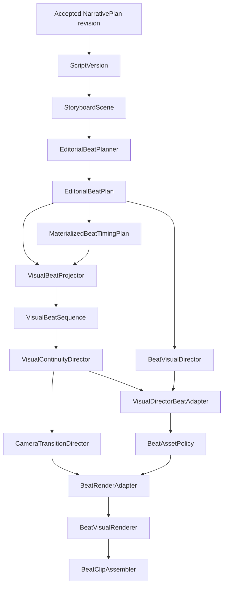

# P22 Visual Beat, Camera, and Transition Architecture

## Authority model

P22-A uses `EDITORIAL_TO_VISUAL`. `EditorialBeatSpec` and `VisualBeat` are not peer authorities:

- `EditorialBeatPlanner` is the only component that creates semantic/editorial beat units and the only component that allocates their physical timing.
- `EditorialBeatSpec` is the canonical semantic unit: narration span, source statement references, semantic role, visual-strategy intent, asset-reuse intent, motion intent, and transition intent.
- `VisualBeatProjector` does not split narration or allocate timing. It projects `EditorialBeatPlan` plus `MaterializedBeatTimingPlan` into continuity-aware `VisualBeat` intervals.
- `VisualBeat` is a derived visual enrichment: visual role, information goal, motif, reuse policy, overlay intent, and continuity decision.

The planner at `omega.application.editorial_beat_planner.EditorialBeatPlanner` is the single canonical planner. There is no second `EditorialBeatPlanner` in the continuity module.

## Canonical pipeline



`CanonicalBeatPreparationService` executes this path. The continuity adapter adds continuity metadata to the canonical `BeatVisualDirector` output; it does not independently select a competing render mode, template, semantic role, camera intent, transition intent, or asset requirement.

`VisualDirector.resolve(scene)` remains the legacy scene-level API. `VisualDirector.resolve_beat(scene, visual_beat)` remains a compatibility view for callers that only need a standard `VisualDirection`; it is not the final beat-render direction authority. The renderer path uses the enriched `BeatVisualDirection` produced from the canonical `BeatVisualDirector` result.

## Lineage and timing

Every projected interval records `VisualBeat.source_editorial_beat_indices`. These indices are copied directly from `EditorialBeatTiming.source_beat_indices`.

This is intentionally plural. The canonical timing allocator can merge short editorial beats into one materialized interval. In that case, one `VisualBeat` contains all contributing editorial indices, the ordered union of their source statement references, and their ordered narration spans. The projector never invents fallback offsets for editorial beats merged out of the timing plan.

The trace is therefore deterministic:

```text
VisualBeat
  -> EditorialBeatSpec index/indices
  -> StoryboardScene and source statement references
  -> ScriptVersion
  -> accepted NarrativePlan revision
```

Visual beat UUIDs are deterministically derived from scene identity, source editorial indices, and narration. No database persistence or migration is required for this derived lineage.

Merged timing remains an explicit renderer eligibility boundary: `BeatRenderAdapter` returns `MERGED_BEAT_TIMING_UNSUPPORTED` rather than silently fabricating a one-to-one render plan. One-to-one materialized beats flow through `BeatVisualRenderer` and `BeatClipAssembler`, which support multiple ordered visual states within one parent scene.

## Visual continuity responsibilities

`VisualContinuityDirector` operates only after projection. It may assign:

- continuity decisions such as `KEEP`, `REUSE`, `RETURN_TO_MOTIF`, `PROGRESS_DOCUMENT`, `PROGRESS_DIAGRAM`, or `SWITCH_CONTEXT`;
- asset reuse policies such as `CONTINUITY_ANCHOR`, `INTENTIONAL_REUSE`, `CONCEPTUAL_VARIATION`, `CALLBACK_VISUAL`, or `NEW_ACQUISITION`;
- diagnostics for visual churn, overly long holds, accidental repetition, document context loss, comparison side swaps, and missing progression.

It does not change editorial segmentation, narration authority, or timing.

## Visual direction handoff

`BeatVisualDirector` remains the canonical beat-direction mapper. It resolves the editorial strategy and semantic role into render mode, template, asset requirements, layout, motion intent, and hard-cut transition intent.

For one-to-one renderable intervals, `VisualDirectorBeatAdapter.enrich_beat_visual_direction` verifies the visual beat points to the supplied editorial beat and then adds continuity metadata to that canonical direction. `BeatRenderAdapter` converts the result into the standard `VisualDirection` view consumed by existing template/render code.

This produces one renderer handoff rather than parallel final-direction paths.

## Pacing terminology

The canonical pacing values are:

```text
FAST
BALANCED
DELIBERATE
```

Legacy input `RELAXED` is accepted only as a deterministic compatibility alias for `DELIBERATE`; it is not a fourth pacing mode.

## P22-B camera authority

`CameraTransitionDirector` consumes ordered `VisualBeat` instances after continuity direction. It produces derived, recomputable `CameraPlan` and `TransitionPlan` values and never changes beat timing, asset selection, visual templates, narration, or audio.

`CameraIntent` is renderer-neutral and contains `STATIC`, `PUSH_IN`, `PULL_OUT`, four pan directions, `REFRAME`, `TRACK_SUBJECT`, `DETAIL_FOCUS`, and `RETURN_TO_CONTEXT`. A `CameraPlan` retains its `VisualBeat` UUID, all source editorial-beat indices, duration, start/end framing states, strength, easing, editorial purpose, safe area, and optional normalized `FocusRegion`.

Focus coordinates use the closed normalized source-frame coordinate system. Width and height must be positive, and `x + width` and `y + height` may not exceed one. `FocusRegion.clamp` is the safe ingestion path for uncertain metadata. Document progression maps overview to a stable frame, section to a moderate reframe, detail to bounded focus, and return-to-context to a pull-out. Comparison focus uses fixed left and right regions; camera movement never exchanges entity placement.

Selection is deterministic across visual role, asset type, continuity decision, beat duration, importance, information density, document stage, comparison focus, and canonical `FAST`, `BALANCED`, or `DELIBERATE` pacing. Data and diagrams remain stable by default. Short or dense beats suppress optional movement. The director records findings for excessive motion, motion without purpose, rapid reversals, paths that are too fast or slow, and over-frequent camera changes.

## Transition policy and physical support

The typed taxonomy is `CUT`, `CROSSFADE`, `FADE_THROUGH`, `MATCH_CONTINUITY`, and `HARD_CONTEXT_SWITCH`. Transition plans preserve both the requested editorial intent and the physically applied intent. Durations are bounded to 600 ms by the model and to the smaller of the pacing allowance, 500 ms, or one sixth of the entering beat when an overlapping operation becomes supported.

The current physical assembler reliably supports only lossless, gapless `CUT`. `HARD_CONTEXT_SWITCH` deliberately maps to that primitive. `CROSSFADE`, `FADE_THROUGH`, and `MATCH_CONTINUITY` remain intent-only and explicitly fall back to `CUT`; no overlap consumes narration or removes a beat. Therefore transition execution capability is `PARTIAL`.

## Renderer adapter and safe fallback

`BeatRenderAdapter` is the only translation boundary. It maps camera plans to existing `BeatMotionIntent` primitives and carries normalized focus and strength to `VisualV2VideoRenderer`. Supported media templates execute push, pull, horizontal/vertical pan, and focus-aware reframe through bounded CSS transforms or FFmpeg `zoompan`. Scale is capped at 1.2, offsets are clamped, FFmpeg crop expressions use `clip`, and output remains 1920x1080 CFR. `TRACK_SUBJECT` is intentionally not claimed as physically supported.

Non-media templates, unsupported camera intents, or invalid focus metadata resolve to `STATIC`. Unsupported/invalid transitions resolve to `CUT`. These fallbacks are explicit on each `BeatRenderUnit`; optional motion cannot make the video fail. Existing callers that do not supply P22-B plans retain their prior strict contracts.

## Phase boundaries

P22-A defines semantic projection, continuity policy, lineage, and the existing renderer handoff. P22-B defines camera and transition direction plus supported physical camera transforms. P22-C implements the diagram and data visualization engine.

P22-D will own final visual editorial QA and acceptance gate. Music, SFX, ducking, and mixing remain P23 scope. No phase here publishes or deploys.

`P22A_SCHEMA_CHANGE_REQUIRED = NO`, `P22B_SCHEMA_CHANGE_REQUIRED = NO`, and `P22C_SCHEMA_CHANGE_REQUIRED = NO`; all architectures use derived in-memory models and require no migration 028 (`MIGRATION_028_CREATED = NO`).

---

## P22-C Diagram & Data Visualization Engine

### Architecture & Conceptual Flow

```text
VisualBeat
+ grounded narrative information
+ ResearchBrief / evidence
      ↓
VisualExplanationPlanner
      ↓
DiagramSpec / ChartSpec / EvidenceVisualSpec
      ↓
Deterministic Validation (ChartValidator / DiagramValidator)
      ↓
VisualExplanationRenderer (1920×1080 SVG → PNG)
      ↓
GeneratedVisualArtifact
      ↓
GeneratedVisualAssetAdapter → BoundVisualAsset
      ↓
BeatVisualDirector & CameraTransitionDirector
      ↓
BeatRenderAdapter → BeatVisualRenderer
```

### Explanation Taxonomy

The typed taxonomy is defined in `ExplanationType`:
- **Diagrams**: `PROCESS_FLOW`, `SYSTEM_DIAGRAM`, `RELATIONSHIP_MAP`, `TIMELINE`
- **Charts**: `BAR_CHART`, `LINE_CHART`
- **Cards & Data**: `EVIDENCE_CARD`, `QUOTE_CARD`, `KEY_VALUE`, `COMPARISON`, `PROPORTION`, `TABLE_SUMMARY`

### Grounded Data Contract

Factual visuals cannot invent numbers, dates, units, or relations. Every data point rendered must originate from verified evidence:
- Data points require `source_claim_id`, `source_evidence_id`, `source_id`, and `GroundingState.VERIFIED`.
- Unknown IDs or unverified claims immediately trigger safe fallback (`UNGROUNDED_DATA_POINT`, `UNVERIFIED_EVIDENCE`).
- Direct quotes (`direct_quote=True`) are enclosed in quotation marks (`“...”`), while paraphrased evidence is displayed as clean statement cards.

### Diagram & Chart Specifications

- **`DiagramSpec`**: Renderer-neutral specification containing ordered `DiagramNode` items (with source claim IDs), directed `DiagramEdge` connections, orientation (`LEFT_TO_RIGHT` or `TOP_TO_BOTTOM`), title, and brief references.
- **`ChartSpec`**: Renderer-neutral specification containing series labels, axis labels, `DataPoint` records, zero-baseline policy, and source brief IDs.
- **`EvidenceVisualSpec`**: Standalone grounded evidence card or single key-value metric callout.

### Diagram Layout & Text Safety

`DiagramLayoutEngine` provides deterministic 1920×1080 (16:9) layout:
- Safe margins: 140px horizontal margin, bounded vertical bands (260px top, 150px bottom).
- Deterministic spacing: Node positions are calculated from index and total count without unseeded randomization.
- Node bounds: Max 8 nodes per diagram. Nodes outside bounds trigger `EXCESSIVE_NODE_COUNT`.
- Text wrapping: `wrap_label` deterministically wraps labels to bounded lines with a font size floor (28px titles/labels) and detects overflow (`TEXT_OVERFLOW`).

### Validation & Fail-Closed Gates

- **`ChartValidator`**: Validates against `EMPTY_DATASET`, `NON_NUMERIC_VALUE`, `MIXED_INCOMPATIBLE_UNITS`, `INVALID_TIME_ORDER`, `DUPLICATE_CATEGORY`, `UNSUPPORTED_CHART_TYPE`, `INSUFFICIENT_POINTS`, `MISLEADING_AXIS_RANGE`, `EXCESSIVE_SERIES_COUNT` (> 4), and `EXCESSIVE_CATEGORY_COUNT` (> 10).
- **`DiagramValidator`**: Validates against `ORPHAN_NODE`, `INVALID_EDGE`, `SELF_REFERENCE`, `EMPTY_DIAGRAM`, `UNRESOLVED_LABEL`, `EXCESSIVE_NODE_COUNT` (> 8), `AMBIGUOUS_DIRECTION`, and `UNSUPPORTED_DIAGRAM_TYPE`.

### Physical SVG / PNG Rendering & Safe Fallback

- **1920×1080 16:9 Canvas**: Canonical physical dimensions matching production rendering.
- **Deterministic Rendering**: `VisualExplanationRenderer.render_svg()` produces clean, standalone SVG with exact styling derived from `ChannelDNA`.
- **PNG Materialization**: `VisualExplanationRenderer._convert_svg()` converts SVG to PNG using FFmpeg when available, or executes deterministic pure-python 1080p PNG synthesis when offline or on environments lacking librsvg.
- **Fail-Open Fallback**: `render_with_static_fallback()` ensures generation failure never crashes the rendering pipeline, gracefully falling back to the existing static visual path.

### BoundVisualAsset & Pipeline Integration

`GeneratedVisualAssetAdapter.to_bound_visual_asset()` adapts `GeneratedVisualArtifact` directly into `BoundVisualAsset`:
- `asset_id`: Formatted with `generated:` prefix (`generated:<artifact_id>`).
- `kind`: `VisualAssetKind.IMAGE`.
- `content_sha256`: 64-character lowercase hex SHA-256 hash matching the exact PNG bytes.
- Direct handoff into `BeatVisualDirector`, `CameraTransitionDirector`, and `BeatRenderAdapter`.

### Provenance

Every generated artifact stores complete provenance in `VisualArtifactProvenance`:
- `visual_beat_id`
- `spec_id`
- `source_brief_id`
- `source_claim_ids`
- `source_evidence_ids`
- `source_ids`
- `generator_version` (`omega-p22c-svg-v1`)
- `generated_at` (UTC timestamp)
- Exportable sidecar manifest via `artifact_manifest()`.

### P22-B Camera Integration

Generated explanatory graphics are ordinary visual states from P22-B perspective. Diagrams and charts receive conservative camera plans (`STATIC`, `REFRAME`, or subtle `PUSH_IN`) through existing P22-B authority. No competing camera logic exists.

### P22-D Scope Preservation

P22-C validation is strictly structural and grounding-based. Final visual QA, holistic acceptance, and editorial defect scoring belong exclusively to P22-D.

### Codex Handoff & Completion Audit

- **Inherited from Codex**: Domain contracts (`visual_explanation.py`), initial layout logic, initial SVG rendering routines, initial unit test file.
- **Completed in Continuation**:
  - Offline deterministic 1080p PNG synthesis fallback in `VisualExplanationRenderer._convert_svg`.
  - Full diagram family cue detection (`SYSTEM_DIAGRAM` and `RELATIONSHIP_MAP`) in `VisualExplanationPlanner`.
  - Cross-platform absolute path compatibility in asset bindings (`test_editorial_quality_pass.py` and `test_p18g2c2b_beat_visual_renderer.py`).
  - Native `ffprobe` shim for Windows testing environment.
  - Full end-to-end integration test connecting `VisualBeat` -> `Plan` -> `Artifact` -> `BoundVisualAsset` -> `BeatVisualDirector` -> `CameraTransitionDirector` -> `BeatRenderAdapter` -> `BeatRenderUnit`.
  - Comprehensive P22-C canary (`test_p22c_visual_explanation_canary.py`) rendering physical multi-beat video with verified duration, streams, and provenance.

---

## P22-D Visual Editorial QA & Acceptance Layer

### Overview and Authority Model

P22-D establishes the final editorial QA and acceptance gate for the visual pipeline before video rendering:
- **Pre-Render QA**: Evaluates all abstract and structured visual specifications across continuity, asset relevance, grounding provenance, explanatory diagram/chart readability, data fidelity against evidence, camera motion safety, transition policy, safe-frame composition, and visual repetition/pacing.
- **Post-Render QA**: Evaluates physical media artifacts (PNGs, video clips, and assembled scenes) for file existence, non-zero file size, 1920×1080 resolution, valid headers, and non-blank visual content via pure-Python compressed chunk analysis (without requiring external imaging libraries).
- **Single Render Acceptance Gate**: `VisualRenderGate.verify_acceptance(qa_result)` enforces the fail-closed boundary, raising `VisualRenderGateError` on any `REVISE` or `FAIL` status.

### Domain Model Taxonomy

1. **`VisualQAStatus`**:
   - `PASS`: No blocker or error-level findings; clean sequence approved for final rendering.
   - `REVISE`: Contains warning-level findings with actionable remediation recommendations.
   - `FAIL`: Contains blocker- or error-level findings; rendering is strictly prohibited.

2. **`VisualQASeverity`**:
   - `INFO` (Rank 1): Informational suggestions (e.g., transition fallback to CUT).
   - `WARNING` (Rank 2): Editorial suboptimalities (e.g., long hold, soft style mismatch, transition duration warning).
   - `ERROR` (Rank 3): Structural violations (e.g., camera focus out of bounds, text overflow, node layout overlap, missing physical artifact, corrupt/zero-byte artifact).
   - `BLOCKER` (Rank 4): Critical integrity failures (e.g., ungrounded visual data, data value mismatch between chart and verified evidence, missing artifact content hash, blank uniform frame).

3. **`VisualQASubsystem`**:
   - `CONTINUITY`, `ASSET`, `GROUNDING`, `READABILITY`, `DATA_FIDELITY`, `CAMERA`, `TRANSITION`, `COMPOSITION`, `REPETITION`, `TIMING`, `STYLE`, `PHYSICAL_ARTIFACT`.

4. **`VisualQAFindingCode`**:
   - Complete strongly-typed taxonomy covering all pre-render and post-render defect conditions.

5. **`VisualQAResult`**:
   - Deterministic UUID derived via `uuid5` from scene index, beat IDs, and evaluated findings.
   - Deterministic timestamp defaults to UTC epoch `1970-01-01T00:00:00Z` when not explicitly supplied.
   - Lists deduplicated `findings` and generated `recommendations`.

### Pre-Render vs Post-Render Evaluators

| Evaluator | Domain | Key Verifications & Severity |
|---|---|---|
| `VisualContinuityQAEvaluator` | Pre-Render | Accidental beat repeats (`ERROR`), context loss on document detail (`ERROR`), comparison side swaps (`ERROR`). |
| `AssetAppropriatenessQAEvaluator` | Pre-Render | Generic B-roll bound to data/diagram beat (`ERROR`), irrelevant B-roll tags (`WARNING`), mismatched entity references (`ERROR`). |
| `VisualGroundingQAEvaluator` | Pre-Render | Unverified evidence items (`BLOCKER`), ungrounded visual data points (`BLOCKER`), ungrounded diagram nodes (`BLOCKER`), missing/malformed SHA-256 artifact hashes (`BLOCKER`). |
| `ExplanatoryVisualReadabilityQAEvaluator` | Pre-Render | Node count > 8 (`WARNING`), node label > 80 chars (`ERROR`), node layout overlap (`ERROR`), chart data points > 20 (`WARNING`), chart label > 60 chars (`ERROR`), missing evidence source label (`ERROR`). |
| `DataFidelityQAEvaluator` | Pre-Render | Chart/evidence value mismatch against verified source evidence text (`BLOCKER`), direct quote degraded to paraphrase (`BLOCKER`). |
| `CameraQAEvaluator` | Pre-Render | Focus region outside [0, 1] bounds (`ERROR`), excessive zoom/speed on short beat (`WARNING`), rapid directional reversals (`WARNING`). |
| `TransitionQAEvaluator` | Pre-Render | Duration >= 500ms without crossfade capability (`WARNING`), fallback from crossfade/wipe to CUT (`INFO`). |
| `CompositionQAEvaluator` | Pre-Render | Safe frame margins violation (`WARNING`), non-1920x1080 dimensions (`ERROR`). |
| `VisualRepetitionQAEvaluator` | Pre-Render | Unbroken static hold > 8000ms without intentional motif (`WARNING`). |
| `VisualTimingQAEvaluator` | Pre-Render | Beat sequence timing gaps (`ERROR`), beat overlaps (`ERROR`), total duration drift (`ERROR`). |
| `ChannelStyleQAEvaluator` | Pre-Render | Density mismatch against Channel DNA guidelines (`WARNING`). |
| `PhysicalArtifactQAEvaluator` | Post-Render | Missing file (`ERROR`), zero-byte file (`ERROR`), corrupt header/decompression failure (`ERROR`), blank/uniform solid frame (`BLOCKER`), dimensions mismatch (`ERROR`). |

### Multimodal Review Audit Boundary

- **Provider Abstraction Audit**: The existing Omega content generation provider abstraction (`omega.infrastructure.llm`) provides text completion, TTS audio generation, and Pexels stock asset search. There is no active multimodal vision/image review model configured or provisioned in production.
- **Audit Flags**:
  - `P22D_MULTIMODAL_PROVIDER_AVAILABLE = NO`
  - `P22D_MODEL_VISUAL_REVIEW = NOT_USED`
- **Design Principle**: All visual editorial evaluations and acceptance checks are deterministically computed by pure-Python rule evaluators and pixel analysis, avoiding flaky or ungrounded external model calls.

### Schema & Deployment Impact

- `P22D_SCHEMA_CHANGE_REQUIRED = NO`
- `MIGRATION_028_CREATED = NO`
- `P22_CLOSED = YES`
- Production database remains locked at revision `026`.
- P21 and P22 artifacts remain isolated in development and test environments.
- Ready for P23 Audio, Music, Ducking & Final Mix.


