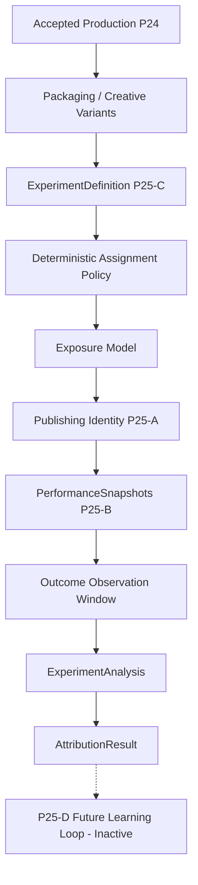

# P25-C — Experimentation & Causal Attribution Architecture

## 1. Architectural Authority & Flow
Omega maintains strict separation of concerns across the content generation, delivery, and analytics lifecycle:
- **P24**: Creative & Brand Acceptance Authority (evaluates finished creative package against ChannelDNA, packaging rules, and CreativeQA).
- **P25-A**: Publishing Authority (delivers accepted assets to external platforms under audited idempotency and token isolation).
- **P25-B**: Performance Analytics Authority (descriptive analytics: *"What happened?"* ingesting provider snapshots and computing deltas).
- **P25-C**: Experimentation & Causal Attribution Authority (*"Under a valid controlled comparison, what difference can be attributed to the tested variant?"*).
- **P25-D**: Learning & Recommendation Authority (*"What should Omega learn or change?"* - deferred to P25-D; strictly out of scope for P25-C).

## 2. Core Concepts & Boundaries

### 2.1 Experiment Authority
`AttributionService` acts as the single canonical seam for experiment lifecycle management (`create_experiment`, `validate_experiment`, `start_experiment`, `record_exposure`, `analyze_experiment`, `complete_experiment`, `invalidate_experiment`). No API handler or external client executes statistical calculations or attribution logic directly.

### 2.2 Variant Semantics & Creative Acceptance Gate
Each variant (`ExperimentVariant`) models exactly one controlled difference (`TITLE`, `THUMBNAIL`, `TITLE_AND_THUMBNAIL`, `DESCRIPTION`, `PACKAGING_BUNDLE`).
- **Independent Acceptance**: Every variant must independently satisfy all P24 acceptance criteria (`is_accepted_p24 = True` and `creative_qa_status = CreativeQAStatus.PASS`). Unaccepted variants cannot enter an experiment.
- **Treatment Isolation**: For packaging experiments, the underlying video artifact identity (`media_artifact_id`) must remain identical between control and treatment variants. Any variation in the underlying render constitutes an invalid, confounded experiment (`INVALID_EXPERIMENT`).

### 2.3 Assignment Unit & Deterministic Policy
Experiments explicitly declare their experimental unit (`IMPRESSION`, `VIEWER`, `PUBLICATION`, `TIME_BUCKET`).
- **Deterministic Allocation**: Assignments use cryptographically salted SHA-256 hash hashing of the subject identity against a persisted `randomization_seed` and `allocation_ratio`. `Math.random()` or unrecorded ephemeral assignments are strictly disallowed.

### 2.4 Exposure Model & Temporal Boundary
An assignment is not an exposure. Deliveries must explicitly record when a subject receives a variant (`ExperimentExposure`).
- Pre-exposure performance leakage is prevented by enforcing `exposure_time <= outcome_time`. Aggregate provider metrics are handled explicitly without fabricating artificial user-level impressions.

### 2.5 Primary Metric Lock
Before transitioning to `RUNNING`, an experiment must lock exactly one `primary_metric` (e.g. `impressions_ctr`, `average_view_duration`, `average_percentage_viewed`). Secondary metrics may be monitored, but cannot replace the primary metric post-hoc to prevent p-hacking.

### 2.6 Data Maturity Gate
P25-C respects P25-B freshness states:
- `DELAYED`: Result remains `WAITING_FOR_MATURITY` / `INSUFFICIENT_DATA`.
- `UNAVAILABLE` or `INVALID`: Experiment is marked `INVALID_EXPERIMENT`.
- An experiment never declares a winner under incomplete or stale data.

### 2.7 Sample Sufficiency & Effect Sizes
- Sample sizes must meet or exceed the predefined `minimum_sample_size` for both control and treatment.
- Effect size calculations include `absolute_difference = treatment_value - control_value` and `relative_lift = absolute_difference / control_value`. Ratios protect against division by zero (returning `None` for undefined lift).

### 2.8 Statistical Inference & Confidence Intervals
- Two-proportion pooled z-tests are applied to rate metrics (e.g. CTR), providing two-tailed p-values alongside unpooled Wald 95% confidence intervals.
- If raw distributions or normality assumptions are not met, the engine returns `INFERENCE_NOT_AVAILABLE` rather than fabricating artificial precision.
- Multiple treatment variants apply Bonferroni corrections ($\alpha / k$).

### 2.9 No Forced Winner Policy
`INCONCLUSIVE` and `NO_MEANINGFUL_DIFFERENCE` are first-class, expected attribution classifications when differences fail to reach statistical significance. Omega never forces a winner without evidence.

### 2.10 Confounding Guard, Overlap Guard & Variant Immutability
- **Confounding Guard**: Mismatched video renders, unaccepted variants, or divergent observation windows trigger an immediate `INVALID_EXPERIMENT` classification.
- **Overlap Guard**: Simultaneous experiments altering the same dimension on the same channel/population are blocked at creation.
- **Variant Immutability**: Variant snapshots are frozen upon `start_experiment`. Any modification to an active variant invalidates the experiment.

### 2.11 Historical Preservation & Replay Idempotency
Completed and mature attribution results (`AttributionResult`) are immutable historical records. Repeatedly analyzing a completed experiment returns the identical `result_id` and attribution facts without creating duplicate analysis rows.

### 2.12 Authority Boundaries: P25-B and P25-D
- **P25-B Input Boundary**: P25-C ingests canonical metric definitions (`CTR`, `watch_time`, `views`) and snapshot freshness states from P25-B without redefining metric semantics.
- **P25-D Output Boundary**: P25-C reports descriptive causal findings (e.g. `TREATMENT_BETTER for impressions_ctr with +24.0% lift`). It **never** mutates ChannelDNA, generates recommendations, or modifies creative strategies. Those responsibilities are strictly deferred to P25-D.
