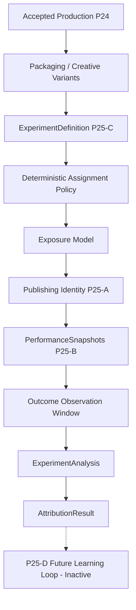

# P25-C — Experimentation & Causal Attribution Architecture

## 1. Architectural Authority & Flow
Omega maintains strict separation of concerns across the content generation, delivery, and analytics lifecycle:
- **P24**: Creative & Brand Acceptance Authority (evaluates finished creative package against ChannelDNA, packaging rules, and CreativeQA).
- **P25-A**: Publishing Authority (delivers accepted assets to external platforms under audited idempotency and token isolation).
- **P25-B**: Performance Analytics Authority (descriptive analytics: *"What happened?"* ingesting provider snapshots and computing deltas).
- **P25-C**: Experimentation & Causal Attribution Authority (*"Under a valid controlled comparison, what difference can be attributed to the tested variant?"*).
- **P25-D**: Learning & Recommendation Authority (*"What should Omega learn or change?"* - deferred to P25-D; strictly out of scope for P25-C).

## 2. Core Concepts & Boundaries

### 2.1 Experiment Authority
`AttributionService` acts as the single canonical seam for experiment lifecycle management (`create_experiment`, `validate_experiment`, `start_experiment`, `record_exposure`, `analyze_experiment`, `complete_experiment`, `invalidate_experiment`). No API handler or external client executes statistical calculations or attribution logic directly.

### 2.2 Variant Semantics & Creative Acceptance Gate
Each variant (`ExperimentVariant`) models exactly one controlled difference (`TITLE`, `THUMBNAIL`, `TITLE_AND_THUMBNAIL`, `DESCRIPTION`, `PACKAGING_BUNDLE`).
- **Independent Acceptance**: Every variant must independently satisfy all P24 acceptance criteria (`is_accepted_p24 = True` and `creative_qa_status = CreativeQAStatus.PASS`). Unaccepted variants cannot enter an experiment.
- **Treatment Isolation**: For packaging experiments, the underlying video artifact identity (`media_artifact_id`) must remain identical between control and treatment variants. Any variation in the underlying render constitutes an invalid, confounded experiment (`INVALID_EXPERIMENT`).

### 2.3 Assignment Unit & Deterministic Policy
Experiments explicitly declare their experimental unit (`IMPRESSION`, `VIEWER`, `PUBLICATION`, `TIME_BUCKET`).
- **Deterministic Allocation**: Assignments use cryptographically salted SHA-256 hash hashing of the subject identity against a persisted `randomization_seed` and `allocation_ratio`. `Math.random()` or unrecorded ephemeral assignments are strictly disallowed.

### 2.4 Exposure Model & Temporal Boundary
An assignment is not an exposure. Deliveries must explicitly record when a subject receives a variant (`ExperimentExposure`).
- Pre-exposure performance leakage is prevented by enforcing `exposure_time <= outcome_time`. Aggregate provider metrics are handled explicitly without fabricating artificial user-level impressions.

### 2.5 Primary Metric Lock
Before transitioning to `RUNNING`, an experiment must lock exactly one `primary_metric` (e.g. `impressions_ctr`, `average_view_duration`, `average_percentage_viewed`). Secondary metrics may be monitored, but cannot replace the primary metric post-hoc to prevent p-hacking.

### 2.6 Data Maturity Gate
P25-C respects P25-B freshness states:
- `DELAYED`: Result remains `WAITING_FOR_MATURITY` / `INSUFFICIENT_DATA`.
- `UNAVAILABLE` or `INVALID`: Experiment is marked `INVALID_EXPERIMENT`.
- An experiment never declares a winner under incomplete or stale data.

### 2.7 Sample Sufficiency & Effect Sizes
- Sample sizes must meet or exceed the predefined `minimum_sample_size` for both control and treatment.
- Effect size calculations include `absolute_difference = treatment_value - control_value` and `relative_lift = absolute_difference / control_value`. Ratios protect against division by zero (returning `None` for undefined lift).

### 2.8 Statistical Inference & Confidence Intervals
- Two-proportion pooled z-tests are applied to rate metrics (e.g. CTR), providing two-tailed p-values alongside unpooled Wald 95% confidence intervals.
- If raw distributions or normality assumptions are not met, the engine returns `INFERENCE_NOT_AVAILABLE` rather than fabricating artificial precision.
- Multiple treatment variants apply Bonferroni corrections ($\alpha / k$).

### 2.9 No Forced Winner Policy
`INCONCLUSIVE` and `NO_MEANINGFUL_DIFFERENCE` are first-class, expected attribution classifications when differences fail to reach statistical significance. Omega never forces a winner without evidence.

### 2.10 Confounding Guard, Overlap Guard & Variant Immutability
- **Confounding Guard**: Mismatched video renders, unaccepted variants, or divergent observation windows trigger an immediate `INVALID_EXPERIMENT` classification.
- **Overlap Guard**: Simultaneous experiments altering the same dimension on the same channel/population are blocked at creation.
- **Variant Immutability**: Variant snapshots are frozen upon `start_experiment`. Any modification to an active variant invalidates the experiment.

### 2.11 Historical Preservation & Replay Idempotency
Completed and mature attribution results (`AttributionResult`) are immutable historical records. Repeatedly analyzing a completed experiment returns the identical `result_id` and attribution facts without creating duplicate analysis rows.

### 2.12 Authority Boundaries: P25-B and P25-D
- **P25-B Input Boundary**: P25-C ingests canonical metric definitions (`CTR`, `watch_time`, `views`) and snapshot freshness states from P25-B without redefining metric semantics.
- **P25-D Output Boundary**: P25-C reports descriptive causal findings (e.g. `TREATMENT_BETTER for impressions_ctr with +24.0% lift`). It **never** mutates ChannelDNA, generates recommendations, or modifies creative strategies. Those responsibilities are strictly deferred to P25-D.

## 3. Durability & Historical Persistence Architecture Audit

### 3.1 Persistence Audit & Process-Local State Findings
An exhaustive audit of schema 027 and `backend/src/omega/` revealed that authoritative experiment state is currently held in process-local dictionaries within `AttributionService`:
- `_experiments`: `AUTHORITATIVE_STATE` (in-memory `dict[UUID, ExperimentDefinition]`)
- `_variants`: `AUTHORITATIVE_STATE` (in-memory `dict[UUID, list[ExperimentVariant]]`)
- `_exposures`: `AUTHORITATIVE_STATE` (in-memory `dict[UUID, list[ExperimentExposure]]`)
- `_results`: `AUTHORITATIVE_STATE` (in-memory `dict[UUID, AttributionResult]`)
- `_variant_snapshots`: `AUTHORITATIVE_STATE` (in-memory `dict[UUID, dict[UUID, dict[str, Any]]]`)

While replay idempotency, confounding guards, and variant immutability fully pass within a single process runtime, **authoritative experiment history does not survive process, worker, or container restarts**.

### 3.2 Schema 027 Analysis
Existing schema 027 tables cannot safely or faithfully represent P25-C controlled experiment truth:
1. `attribution_delivery_evidence` (Migration 018): Designed strictly for copyright/content citation delivery evidence, bound by check constraints (`delivery_channel IN ('PHYSICAL_RENDER', 'PUBLISH_METADATA', 'EXPORT_SIDECAR')`).
2. `content_campaigns` (Migration 020): Designed for multi-video publishing campaigns without variant, split, or exposure semantics.
3. `learning_hypotheses` & `learning_hypothesis_evaluations` (Migration 013): Designed for P13 observational cohort learning. They lack variant models, require foreign keys to `learning_cohorts` and `learning_baselines`, enforce incompatible evaluation status enums (`SUPPORTED`, `WEAKENED`, `CONTRADICTED`), and conflate causal attribution with the P25-D learning loop.

### 3.3 Proposed Relational Persistence Specification (Migration 028 Request)
Under the strict Schema Rule, migration 028 was **NOT** created. Durable persistence requires explicit user/system authorization for migration 028 with the following schema:

1. **`experiment_definitions` Table**:
   - `id`: `UUID PRIMARY KEY`
   - `channel_id`: `UUID NOT NULL REFERENCES channels(id) ON DELETE RESTRICT`
   - `experiment_type`: `VARCHAR(32) NOT NULL` (Check: `TITLE`, `THUMBNAIL`, `TITLE_AND_THUMBNAIL`, `DESCRIPTION`, `PACKAGING_BUNDLE`)
   - `hypothesis`: `TEXT NOT NULL`
   - `primary_metric`: `VARCHAR(64) NOT NULL`
   - `secondary_metrics`: `JSONB NOT NULL DEFAULT '[]'`
   - `control_variant_id`: `UUID NOT NULL`
   - `treatment_variant_ids`: `JSONB NOT NULL`
   - `assignment_policy`: `JSONB NOT NULL`
   - `experiment_unit`: `VARCHAR(32) NOT NULL` (Check: `IMPRESSION`, `VIEWER`, `PUBLICATION`, `TIME_BUCKET`)
   - `minimum_sample_size`: `INTEGER NOT NULL DEFAULT 1000`
   - `status`: `VARCHAR(32) NOT NULL` (Check: `DRAFT`, `READY`, `RUNNING`, `PAUSED`, `COMPLETED`, `CANCELLED`, `INVALIDATED`)
   - `start_at`: `TIMESTAMPTZ NULL`
   - `end_at`: `TIMESTAMPTZ NULL`
   - `analysis_window_hours`: `INTEGER NOT NULL DEFAULT 24`
   - `revision_number`: `INTEGER NOT NULL DEFAULT 1`
   - `provenance`: `JSONB NOT NULL DEFAULT '{}'`
   - `created_at`: `TIMESTAMPTZ NOT NULL DEFAULT now()`
   - Unique Partial Index for Overlap Guard: `CREATE UNIQUE INDEX uq_active_channel_experiment_type ON experiment_definitions (channel_id, experiment_type) WHERE status IN ('READY', 'RUNNING');`

2. **`experiment_variants` Table**:
   - `id`: `UUID PRIMARY KEY`
   - `experiment_id`: `UUID NOT NULL REFERENCES experiment_definitions(id) ON DELETE CASCADE`
   - `role`: `VARCHAR(16) NOT NULL` (Check: `CONTROL`, `TREATMENT`)
   - `change_dimension`: `VARCHAR(32) NOT NULL`
   - `media_artifact_id`: `UUID NOT NULL REFERENCES media_artifacts(id) ON DELETE RESTRICT`
   - `packaging_plan_id`: `UUID NULL`
   - `title`: `TEXT NULL`
   - `thumbnail_concept_id`: `UUID NULL`
   - `thumbnail_ref`: `TEXT NULL`
   - `is_accepted_p24`: `BOOLEAN NOT NULL DEFAULT FALSE`
   - `creative_qa_status`: `VARCHAR(16) NOT NULL DEFAULT 'FAIL'`
   - `variant_snapshot_hash`: `VARCHAR(64) NOT NULL`
   - `provenance`: `JSONB NOT NULL DEFAULT '{}'`
   - `created_at`: `TIMESTAMPTZ NOT NULL DEFAULT now()`
   - Constraints: `UNIQUE (experiment_id, id)`, `UNIQUE (experiment_id, role) WHERE role = 'CONTROL'`

3. **`experiment_exposures` Table**:
   - `id`: `UUID PRIMARY KEY`
   - `experiment_id`: `UUID NOT NULL REFERENCES experiment_definitions(id) ON DELETE CASCADE`
   - `variant_id`: `UUID NOT NULL`
   - `subject_id`: `VARCHAR(128) NOT NULL`
   - `exposed_at`: `TIMESTAMPTZ NOT NULL DEFAULT now()`
   - `aggregate_sample_count`: `INTEGER NOT NULL DEFAULT 1`
   - Foreign Key: `FOREIGN KEY (experiment_id, variant_id) REFERENCES experiment_variants(experiment_id, id) ON DELETE CASCADE`

4. **`experiment_attribution_results` Table**:
   - `id`: `UUID PRIMARY KEY`
   - `experiment_id`: `UUID NOT NULL REFERENCES experiment_definitions(id) ON DELETE RESTRICT`
   - `revision_number`: `INTEGER NOT NULL DEFAULT 1`
   - `control_variant_id`: `UUID NOT NULL`
   - `treatment_variant_id`: `UUID NOT NULL`
   - `primary_metric`: `VARCHAR(64) NOT NULL`
   - `analysis_window`: `VARCHAR(32) NOT NULL`
   - `control_value`: `DOUBLE PRECISION NULL`
   - `treatment_value`: `DOUBLE PRECISION NULL`
   - `absolute_difference`: `DOUBLE PRECISION NULL`
   - `relative_lift`: `DOUBLE PRECISION NULL`
   - `sample_basis`: `JSONB NOT NULL DEFAULT '{}'`
   - `statistical_inference`: `JSONB NULL`
   - `data_maturity`: `VARCHAR(32) NOT NULL`
   - `classification`: `VARCHAR(32) NOT NULL`
   - `findings`: `JSONB NOT NULL DEFAULT '[]'`
   - `input_snapshot_ids`: `JSONB NOT NULL DEFAULT '[]'` (Lineage to exact P25-B snapshots)
   - `evaluated_at`: `TIMESTAMPTZ NOT NULL DEFAULT now()`
   - `provenance`: `JSONB NOT NULL DEFAULT '{}'`
   - Unique Constraint: `UNIQUE (experiment_id, revision_number, analysis_window)` (Guarantees replay idempotency across process restarts)

