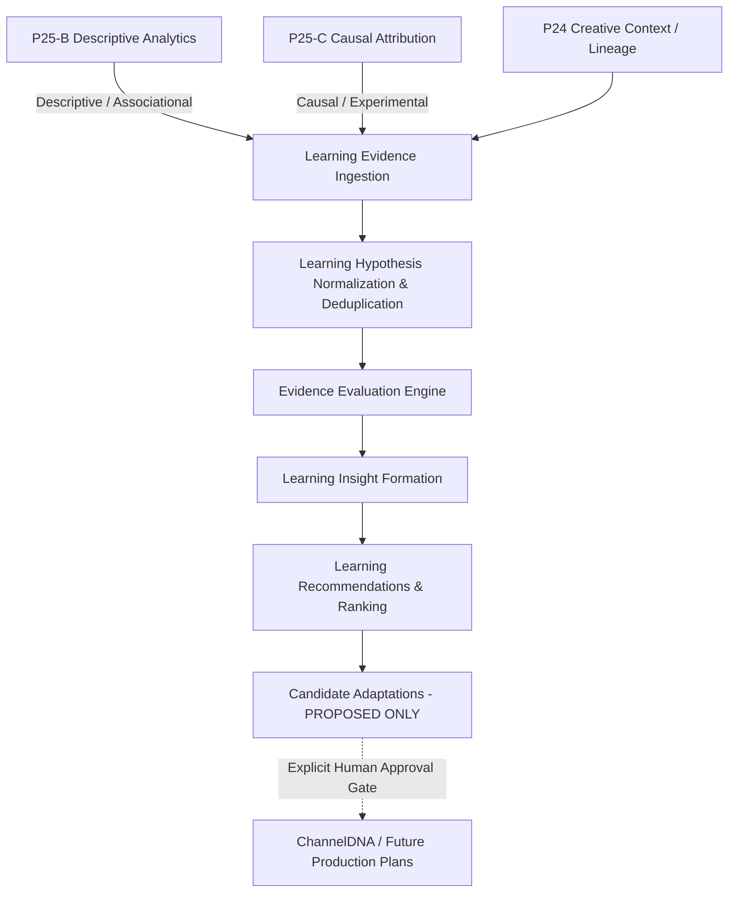

# P25-D — Evidence-Based Learning Loop Architecture

## 1. Architectural Authority & Flow
Omega maintains strict separation of concerns across the content generation, delivery, analytics, and learning lifecycle:
- **P24**: Creative & Brand Acceptance Authority (evaluates finished creative package against ChannelDNA, packaging rules, and CreativeQA).
- **P25-A**: Publishing Authority (delivers accepted assets to external platforms under audited idempotency and token isolation).
- **P25-B**: Performance Analytics Authority (descriptive analytics: *"What happened?"* ingesting provider snapshots and computing deltas).
- **P25-C**: Experimentation & Causal Attribution Authority (*"Under a valid controlled comparison, what difference can be attributed to the tested variant?"*).
- **P25-D**: Learning & Recommendation Authority (*"What has Omega learned from evidence, how strong is that learning, and what should be considered for future productions?"*).

---

## 2. Evidence Hierarchy & Causality Semantics

### 2.1 Explicit 5-Tier Hierarchy
Every piece of evidence consumed by P25-D is categorized strictly into one of five hierarchical tiers:
- **Tier 1 (Causal - Single Valid Experiment)**: Valid, completed, mature P25-C causal attribution result with clear sample sufficiency.
- **Tier 2 (Causal - Replicated Experiments)**: Multiple independent, consistent P25-C causal experiment results confirming the same effect across comparable scopes.
- **Tier 3 (Multi-Production Observational)**: Multi-production observational evidence from P25-B with controlled context (e.g., across multiple releases within the same pillar).
- **Tier 4 (Single-Production Descriptive)**: Single-production descriptive performance association from P25-B (e.g., snapshot counter changes).
- **Tier 5 (Heuristic / Insufficient)**: Prior heuristics, incomplete experiment runs, or insufficient sample data.

### 2.2 Causality Policy
- **CAUSAL**: Assigned **only** to mature, completed, non-invalidated P25-C attribution results with sufficient sample sizes.
- **ASSOCIATIONAL / DESCRIPTIVE**: Assigned to observational performance data from P25-B. P25-B performance data alone is **never** marked `CAUSAL`.
- **HEURISTIC / INSUFFICIENT**: Assigned when sample size or maturity requirements are not met.

---

## 3. Learning Hypotheses & Lifecycle

### 3.1 Hypothesis Definition & Scoping
A hypothesis expresses a single, bounded claim regarding a target creative dimension and predicted metric effect within an explicit scope:
- `target_dimension`: Creative dimension under investigation (e.g., `TITLE`, `THUMBNAIL`, `PACING`, `AUDIO_DENSITY`).
- `scope`: Bounded dictionary specifying channel, pillar, format, duration class, and platform. Generalizations across scopes are forbidden without replicated evidence.
- `direction`: Expected effect (`INCREASE`, `DECREASE`, `NEUTRAL`).

### 3.2 Deduplication Engine
Hypotheses are deterministically deduplicated using SHA-256 fingerprinting across `(channel_id, target_dimension, target_metric, scope, direction)`. Incoming evidence updates the evaluation history of the existing canonical hypothesis rather than creating semantic duplicates.

### 3.3 Deterministic Lifecycle States
- `PROPOSED`: Registered hypothesis awaiting evaluation.
- `EVALUATING`: Active evidence accumulation.
- `SUPPORTED`: Statistically backed by consistent causal evidence with no unresolved major tradeoffs.
- `WEAKENED`: Evidence presents conflicting results or unacceptable cross-metric tradeoffs.
- `CONTRADICTED`: Rigorous causal evidence refutes the predicted effect direction.
- `INCONCLUSIVE`: Conflicting signals or insufficient data maturity.
- `RETIRED`: Superseded by newer policy or explicitly archived.

---

## 4. Evaluation Engine, Tradeoffs & Recency

### 4.1 Cross-Metric Tradeoffs & Goodhart Guard
P25-D refuses to optimize single metrics blindly:
- When a variant increases CTR (+24%) but severely impairs retention/average view duration (-18%), the engine detects a tradeoff.
- The evaluation records contradictory evidence, downgrades hypothesis status to `WEAKENED`, bounds confidence at `LOW`, and proposes `RUN_FOLLOWUP_EXPERIMENT`.
- Clickbait limits and brand safety rules from ChannelDNA and P24-D are hard constraints that cannot be overridden by metric lift.

### 4.2 Temporal Decay & Recency Policy
Evidence undergoes transparent exponential decay:
$$\text{weight} = \exp\left(-\frac{\Delta t \cdot \ln(2)}{\tau}\right)$$
Where $\tau = 90\text{ days}$ (half-life). Historical evidence remains immutable; recency affects evaluation weighting, not historical record.

### 4.3 Deterministic Confidence Taxonomy
Confidence levels are strictly deterministic:
- `HIGH`: Requires replicated Tier 2 causal evidence, or high-powered Tier 1 evidence with zero conflicting signals.
- `MODERATE`: Supported Tier 1 causal evidence with minor sample variances.
- `LOW`: Tier 3 observational evidence, or conflicting Tier 1/2 evidence.
- `VERY_LOW`: Tier 4/5 descriptive signals or underpowered samples.

---

## 5. Recommendations & Candidate Adaptations

### 5.1 Recommendation Actions & Ranking
The engine produces typed recommendations:
- `CONSIDER_TITLE_STYLE`, `CONSIDER_THUMBNAIL_STYLE`, `CONSIDER_PACING_CHANGE`, `CONSIDER_VISUAL_DENSITY`, `CONSIDER_AUDIO_DENSITY`, `CONSIDER_FORMAT_STRATEGY`, `RUN_FOLLOWUP_EXPERIMENT`, `KEEP_CURRENT_POLICY`.
- Ranking is determined by a deterministic score combining evidence quality, confidence, scope precision, tradeoff penalties, and risk—**not** raw effect lift.

### 5.2 Strict Approval Boundary & Zero Automatic Mutation
- P25-D **never** directly mutates `ChannelDNARevision`, `CreativeStylePlan`, `NarrativePlan`, or packaging rules.
- Instead, P25-D generates immutable `CandidateAdaptation` objects with `status = PROPOSED`.
- Applying any adaptation to canonical creative authority requires explicit human producer review and sign-off, which then generates a new immutable revision in future production planning.

---

## 6. Observability, Durability & Migration 029 Specification

### 6.1 Observability
Structured, audit-safe events are emitted for:
- `EVIDENCE_INGESTED`, `HYPOTHESIS_REGISTERED`, `EVALUATION_COMPLETED`, `TRADEOFF_DETECTED`, `RECOMMENDATION_GENERATED`, `CANDIDATE_ADAPTATION_PROPOSED`.
- No secrets or private provider credentials are logged.

### 6.2 Durability & Section 43 Schema Audit
An exhaustive audit of migration 013 revealed that existing schema tables (`learning_hypotheses`, `learning_hypothesis_evaluations`, `learning_knowledge_items`) are coupled to 013 cohort/baseline structures and cannot represent:
1. P25-C causal attribution inputs and P25-B multi-tier evidence.
2. Cross-metric tradeoffs and contradictory evidence ID lists.
3. Typed recommendations with explainability fields.
4. Candidate adaptations with explicit approval lifecycle states (`PROPOSED`, `APPROVED`, `REJECTED`, `EXPIRED`, `SUPERSEDED`).
5. Learning policy versioning.

Under Section 43, Migration 029 was **not** automatically applied to the development database. Full schema authorization is required prior to applying migration 029.
