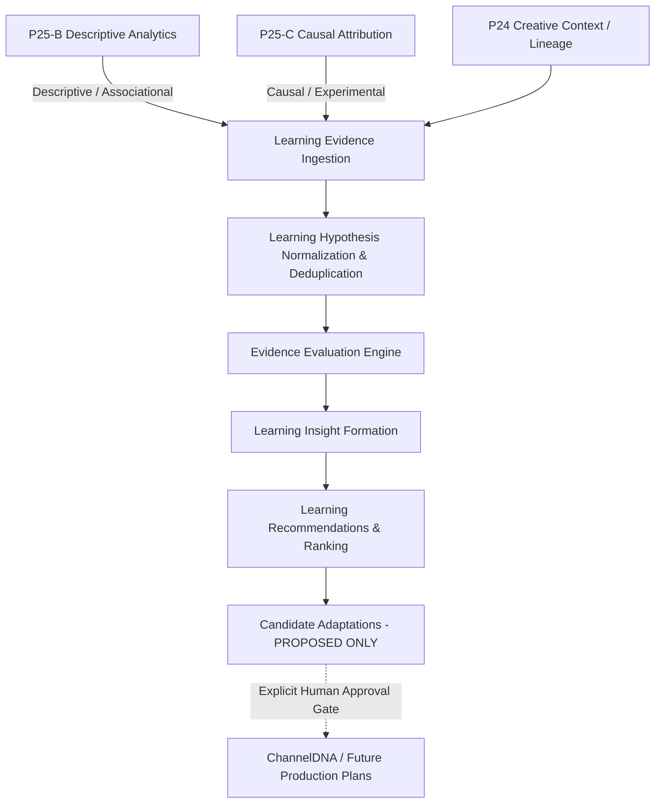

# P25-D — Evidence-Based Learning Loop Architecture

## 1. Architectural Authority & Flow
Omega maintains strict separation of concerns across the content generation, delivery, analytics, and learning lifecycle:
- **P24**: Creative & Brand Acceptance Authority (evaluates finished creative package against ChannelDNA, packaging rules, and CreativeQA).
- **P25-A**: Publishing Authority (delivers accepted assets to external platforms under audited idempotency and token isolation).
- **P25-B**: Performance Analytics Authority (descriptive analytics: *"What happened?"* ingesting provider snapshots and computing deltas).
- **P25-C**: Experimentation & Causal Attribution Authority (*"Under a valid controlled comparison, what difference can be attributed to the tested variant?"*).
- **P25-D**: Learning & Recommendation Authority (*"What has Omega learned from evidence, how strong is that learning, and what should be considered for future productions?"*).

---

## 2. Evidence Hierarchy & Causality Semantics

### 2.1 Explicit 5-Tier Hierarchy
Every piece of evidence consumed by P25-D is categorized strictly into one of five hierarchical tiers:
- **Tier 1 (Causal - Single Valid Experiment)**: Valid, completed, mature P25-C causal attribution result with clear sample sufficiency.
- **Tier 2 (Causal - Replicated Experiments)**: Multiple independent, consistent P25-C causal experiment results confirming the same effect across comparable scopes.
- **Tier 3 (Multi-Production Observational)**: Multi-production observational evidence from P25-B with controlled context (e.g., across multiple releases within the same pillar).
- **Tier 4 (Single-Production Descriptive)**: Single-production descriptive performance association from P25-B (e.g., snapshot counter changes).
- **Tier 5 (Heuristic / Insufficient)**: Prior heuristics, incomplete experiment runs, or insufficient sample data.

### 2.2 Causality Policy
- **CAUSAL**: Assigned **only** to mature, completed, non-invalidated P25-C attribution results with sufficient sample sizes.
- **ASSOCIATIONAL / DESCRIPTIVE**: Assigned to observational performance data from P25-B. P25-B performance data alone is **never** marked `CAUSAL`.
- **HEURISTIC / INSUFFICIENT**: Assigned when sample size or maturity requirements are not met.

---

## 3. Learning Hypotheses & Lifecycle

### 3.1 Hypothesis Definition & Scoping
A hypothesis expresses a single, bounded claim regarding a target creative dimension and predicted metric effect within an explicit scope:
- `target_dimension`: Creative dimension under investigation (e.g., `TITLE`, `THUMBNAIL`, `PACING`, `AUDIO_DENSITY`).
- `scope`: Bounded dictionary specifying channel, pillar, format, duration class, and platform. Generalizations across scopes are forbidden without replicated evidence.
- `direction`: Expected effect (`INCREASE`, `DECREASE`, `NEUTRAL`).

### 3.2 Deduplication Engine
Hypotheses are deterministically deduplicated using SHA-256 fingerprinting across `(channel_id, target_dimension, target_metric, scope, direction)`. Incoming evidence updates the evaluation history of the existing canonical hypothesis rather than creating semantic duplicates.

### 3.3 Deterministic Lifecycle States
- `PROPOSED`: Registered hypothesis awaiting evaluation.
- `EVALUATING`: Active evidence accumulation.
- `SUPPORTED`: Statistically backed by consistent causal evidence with no unresolved major tradeoffs.
- `WEAKENED`: Evidence presents conflicting results or unacceptable cross-metric tradeoffs.
- `CONTRADICTED`: Rigorous causal evidence refutes the predicted effect direction.
- `INCONCLUSIVE`: Conflicting signals or insufficient data maturity.
- `RETIRED`: Superseded by newer policy or explicitly archived.

---

## 4. Evaluation Engine, Tradeoffs & Recency

### 4.1 Cross-Metric Tradeoffs & Goodhart Guard
P25-D refuses to optimize single metrics blindly:
- When a variant increases CTR (+24%) but severely impairs retention/average view duration (-18%), the engine detects a tradeoff.
- The evaluation records contradictory evidence, downgrades hypothesis status to `WEAKENED`, bounds confidence at `LOW`, and proposes `RUN_FOLLOWUP_EXPERIMENT`.
- Clickbait limits and brand safety rules from ChannelDNA and P24-D are hard constraints that cannot be overridden by metric lift.

### 4.2 Temporal Decay & Recency Policy
Evidence undergoes transparent exponential decay, floored at 0.10:
$$\text{weight} = \exp\left(-\frac{\Delta t \cdot \ln(2)}{\tau}\right)$$
Where $\tau = 90\text{ days}$ (half-life). Historical evidence remains immutable; recency affects evaluation weighting, not historical record.

### 4.3 Deterministic Confidence Taxonomy
Confidence levels are strictly deterministic:
- `HIGH`: Requires the configured minimum independent causal replications with no conflicting tradeoff.
- `MODERATE`: Supported Tier 1 causal evidence with minor sample variances.
- `LOW`: Tier 3 observational evidence, or conflicting Tier 1/2 evidence.
- `VERY_LOW`: Tier 4/5 descriptive signals or underpowered samples.

---

## 5. Recommendations & Candidate Adaptations

### 5.1 Recommendation Actions & Ranking
The engine produces typed recommendations:
- `CONSIDER_TITLE_STYLE`, `CONSIDER_THUMBNAIL_STYLE`, `CONSIDER_PACING_CHANGE`, `CONSIDER_VISUAL_DENSITY`, `CONSIDER_AUDIO_DENSITY`, `CONSIDER_FORMAT_STRATEGY`, `RUN_FOLLOWUP_EXPERIMENT`, `KEEP_CURRENT_POLICY`.
- Ranking is determined by a deterministic score combining evidence quality, confidence, scope precision, tradeoff penalties, and risk—**not** raw effect lift.

### 5.2 Strict Approval Boundary & Zero Automatic Mutation
- P25-D **never** directly mutates `ChannelDNARevision`, `CreativeStylePlan`, `NarrativePlan`, or packaging rules.
- Instead, P25-D generates immutable `CandidateAdaptation` objects with `status = PROPOSED`.
- Applying any adaptation to canonical creative authority requires explicit human producer review and sign-off, which then generates a new immutable revision in future production planning.

---

## 6. Observability, Durability & Migration 029 Specification

### 6.1 Observability
Structured, audit-safe events are emitted for:
- `EVIDENCE_INGESTED`, `HYPOTHESIS_REGISTERED`, `EVALUATION_COMPLETED`, `TRADEOFF_DETECTED`, `RECOMMENDATION_GENERATED`, `CANDIDATE_ADAPTATION_PROPOSED`.
- No secrets or private provider credentials are logged.

### 6.2 Durability & Section 43 Schema Audit
An exhaustive audit of migration 013 revealed that existing schema tables (`learning_hypotheses`, `learning_hypothesis_evaluations`, `learning_knowledge_items`) are coupled to 013 cohort/baseline structures and cannot represent:
1. P25-C causal attribution inputs and P25-B multi-tier evidence.
2. Cross-metric tradeoffs and contradictory evidence ID lists.
3. Typed recommendations with explainability fields.
4. Candidate adaptations with explicit approval lifecycle states (`PROPOSED`, `APPROVED`, `REJECTED`, `EXPIRED`, `SUPERSEDED`).
5. Learning policy versioning.

Migration 029 is authorized for development and isolated PostgreSQL only. It is
not a production rollout. P25-D orchestration is `P25DLearningService`, backed by
one `LearningRepository`; `P25DQueryService` reloads historical state from that repository.

## 7. Durable schema and legacy reconciliation

Migration 013 remains unchanged. Its `learning_hypotheses` and
`learning_hypothesis_evaluations` describe observational cohort/baseline analyses;
`learning_knowledge_items` records that legacy knowledge. `learning_cohorts`,
`learning_cohort_members`, and `learning_baselines` remain their original authority.
The legacy `evaluation_service.py` writes only those legacy structures and cannot
produce P25-D recommendations. Any future legacy-to-P25-D ingestion must enter
through `LearningRepository.persist_evidence` as explicitly observational evidence,
with source IDs and classification reasons. There is no automatic backfill or
promotion of legacy knowledge to causal truth.

Migration 029 adds these separate canonical P25-D tables:

| Table | Durable purpose |
| --- | --- |
| `learning_policy_roots` | Named policy identity and current revision projection |
| `learning_policy_revisions` | Immutable complete configuration and SHA-256 fingerprint |
| `learning_loop_evidence` | Immutable bounded evidence, source FKs, classification reason, lossless snapshot |
| `learning_hypothesis_roots` | Channel/context claim identity, deduplication, current status projection |
| `learning_hypothesis_revisions` | Immutable definition, revision number, definition fingerprint |
| `learning_evaluations` | Immutable result, exact revision inputs, replay identity, evaluation time |
| `learning_evaluation_evidence_memberships` | Normalized evidence IDs, roles, and frozen recency weights |
| `learning_insights` | One immutable synthesis per exact evaluation |
| `learning_recommendations` | Exact insight/evaluation/policy lineage, deterministic replay fingerprint |
| `learning_candidate_adaptations` | Immutable proposal with a mutable audited status projection |
| `learning_adaptation_approval_history` | Append-only initial proposal and producer decision history |

The existing migration file is repaired in place; there is exactly one 029.
Migration 028 and the experiment authority are unchanged. Source foreign keys use
`RESTRICT`, so deleting an upstream source cannot erase historical evidence lineage.
JSON snapshots complement normalized identities; they do not replace evaluation
memberships or source foreign keys. Derived CreativeStylePlan and PackagingPlan
objects receive no invented foreign keys.

## 8. Immutable identities and deterministic policy

`LearningPolicy` contains all configurable evaluation and recommendation rules:
sample minimums, replication threshold, causal weighting, support ratio, recency
half-life, generalization minimum, tradeoff threshold, ranking parameters, brand
safety version, and algorithm version. Canonical serialization sorts keys, uses
compact JSON separators, and rejects non-finite values. The SHA-256 covers the
complete configuration, including the label. There are no random IDs or timestamps
in this fingerprint.

Same root and same complete configuration reuse the same immutable revision.
The same label with different configuration creates a new sequential revision;
labels are descriptive, not the identity. Full configuration and the normalized
rule columns are both stored. The fixed behavior of `p25d-evaluation-v1` includes
the observational confidence bound, tradeoff guard, local generalization, producer
review, and prohibition on automatic application. Unsupported algorithm versions
are rejected; future algorithm changes must add a supported immutable implementation
and a new version. Old evaluations and frozen weights are returned on replay, not
recomputed using the current clock.

Hypothesis root deduplication covers channel, creative dimension, pillar, format,
metric, direction, and target scope type/ID. A changed claim or evidence requirement
under that root creates a content-addressed immutable definition revision.
Evaluation status is distinct from definition revision history.

An evaluation's unique logical identity is:

`(hypothesis_revision_id, policy_revision_id, exact_sorted_unique_evidence_ID_set_fingerprint)`.

Changing any of these creates a new evaluation. Changing only the replay clock
returns the original result. First evaluation time is recorded in both `evaluated_at`
and provenance; recency weights are fixed using that one time. Membership roles are
`SUPPORTING`, `CONTRADICTING`, `CONTEXT`, or `TRADEOFF`. Negative cross-metric evidence
gets `TRADEOFF`, and the facts and limitations remain in the immutable result.

Repository advisory transaction locks serialize content identity creation and
revision numbering. Database unique constraints enforce the identities. Root
status/current revision fields are projections only; historical outputs never
consult them for truth.

## 9. Source truth and historical recommendation lineage

Causal ingestion requires an existing exact P25-C AttributionResult and matching
experiment/channel, metric, lift, maturity, classification, sample basis, inference,
variant IDs, fingerprint, and evaluation time. Invalid, inconclusive, immature,
insignificant, or insufficient-sample inputs cannot produce strong causal evidence.
Evidence persists the result FK and the experiment root/revision and variant IDs,
classification rationale, source fingerprint, and source snapshot facts.

P25-B evidence requires its exact durable provider snapshot for the same channel.
It retains that FK, provider checksum, derived evidence facts, and an observational
classification reason. P25-B-only evidence never becomes CAUSAL, never generates
a strong causal adaptation, and remains bounded after restart. Safety/brand or
legacy contextual evidence can use explicit noncausal source snapshots and IDs;
such sources cannot authorize a causal claim.

Recommendation generation starts from the persisted insight ID and follows:

`Insight -> exact Evaluation -> exact HypothesisRevision + PolicyRevision + Memberships`.

The historical evaluation supplies the hypothesis status. The historical policy
supplies ranking parameters. Caller-supplied current hypotheses/policies cannot
override these pins. There is no latest-evaluation lookup. Composite database
foreign keys additionally reject mismatched insight/evaluation/policy references.
Replay fingerprints include insight/evaluation/policy IDs, action, target authority,
proposed change, scope, and expected metrics. A replay returns persisted recommendation
and candidate IDs rather than newly computed random IDs.

Brand safety is recorded as `REQUIRES_PRODUCER_REVIEW`; persistence does not invent
a brand-safety PASS. Goodhart facts remain bounded by persisted tradeoff evidence.

## 10. Approval, history, and restart recovery

Candidate proposals start at PROPOSED with an initial immutable audit row. Producer
transitions append actor, reason, time, and from/to status before updating the
current status projection. Transitions are serialized with a row lock. Invalid
transitions and missing actors/reasons fail. Database triggers reject proposal
payload changes, deletion, or status changes without matching immutable history.
APPROVED means an approved proposal only. This service has no application method
and does not mutate ChannelDNARevision, CreativeStylePlan, NarrativePlan,
PackagingPlan, pacing, or audio/music/SFX policies.

Database triggers reject UPDATE/DELETE of policy revisions, evidence, hypothesis
definitions, evaluations, memberships, insights, recommendations, and approval
history. New evidence and new policies append new results; old confidence,
tradeoffs, source lineage, recommendations, and proposal snapshots remain unchanged.

`P25DQueryService.async_get_evidence_trace` exposes root/revision IDs and revision
numbers, policy configuration/fingerprint, exact source IDs and FKs, memberships
and roles, evaluation time/status/confidence, tradeoffs, limitations, provenance,
insights, recommendations, candidate status, immutable proposals, and approval history.
Lossless loaders reconstruct domain objects from the database alone.

State classification:

| Structure | Classification |
| --- | --- |
| `LearningRules` local dict/list values | Transient inputs/outputs; no authoritative storage |
| Repository/query local collections | Transient DB results; reloadable from PostgreSQL |
| `P25DLearningService.repository` / query repository | Dependency reference; no cached learning state |
| `TestOnlyLearningService` five class stores | TEST_ONLY original synchronous logic harness |
| `LearningService` / `LearningQueryService` old aliases | TEST_ONLY compatibility imports for original canaries |
| Domain dict/list fields | Serialized immutable facts; canonical copies live in PostgreSQL |

Canonical services never read the TEST_ONLY harness stores. Removing all those
stores cannot change database-backed answers. No module-level canonical caches exist.

The explicit `test_p25d_database_only_restart_recovery` creates causal and descriptive
evidence, policy, hypothesis, evaluation, memberships, insight, recommendation, and
candidate; commits; lets every setup domain/service/repository object leave scope;
expunges and closes the session; and constructs fresh objects. Only primitive IDs
and a serialized expected trace survive. The complete trace must match, and replay
must preserve all four canonical output row counts and identities. Additional
tests cover changed policies under the same label, history append, historical
recommendation generation, tradeoffs, observational bounds, approval history,
source forgery/context guards, hypothesis revisions, and database immutability.

## 11. Migration verification and production boundary

`backend/scripts/verify_p25d_029_migration.py` requires the dedicated empty local
`p25d029_repair_test` database on port 5433. It refuses other targets, then executes
028 -> 029 -> 028 -> 029 and compares the resulting tables/columns/types/nullability,
foreign keys, indexes, uniqueness, and check constraints to the ORM. Repository
tests run against the resulting fresh 029 schema. The earlier interrupted
`p20c_final_test` database at 029 is preserved and is not used as proof of the
repaired migration. Its older 029 schema must be rebuilt or explicitly reconciled
before running repaired code there; the revision label alone is insufficient.

Production remains revision 026 and image `omega:p20-d2-db-hardened-fd26f244`.
Neither migration 028 nor 029 is applied there. Publisher remains absent and
P21-P25 remain undeployed. Verification of production is read-only. Migration
rollback is deliberately destructive to the isolated learning tables; it is an
isolated lifecycle test, not a production data retention procedure.

## 12. Completed repair verification — 2026-10-04

The final bounded PostgreSQL run completed with **191 passed, zero failed**:

| Suite | Passed |
| --- | ---: |
| P25-D database persistence/recovery | 15 |
| P25-D original logic and canaries | 17 |
| P25-C causal logic, canaries, durability | 23 |
| P25-B analytics and canaries | 20 |
| P25-A authority reconciliation and publishing canaries | 9 |
| Additional P25-A publishing unit tests | 16 |
| Migration-013 domain/math, services/API, export/ingestion | 91 |
| Total | 191 |

The migration lifecycle and ORM parity verifier passed separately on a newly
created `p25d029_repair_test` database. The final repository suites used that
verified schema. The initial interrupted database was preserved.

Windows sandbox ACLs prevented pytest from reading its temporary directories;
the successful run used approved elevated execution and a dedicated workspace
temporary directory. This changed execution permissions only, not the database
target or tests. One existing Starlette deprecation warning was emitted by
`api/router.py`. Targeted Ruff checks passed; the unchanged models import block
around line 6042 retains its pre-existing E402/I001 style findings.

Final read-only production verification returned revision **026**. Canonical
API, worker, and beat containers retained `omega:p20-d2-db-hardened-fd26f244`;
no publisher container was present. There was no deployment, push, provider
mutation, or application of a learning recommendation/adaptation.
