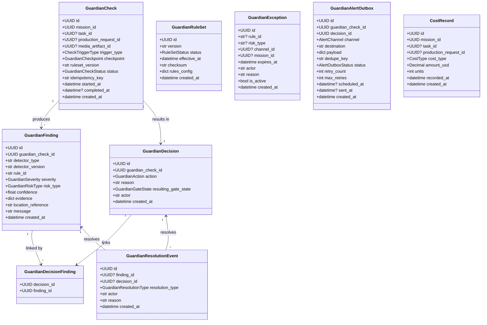
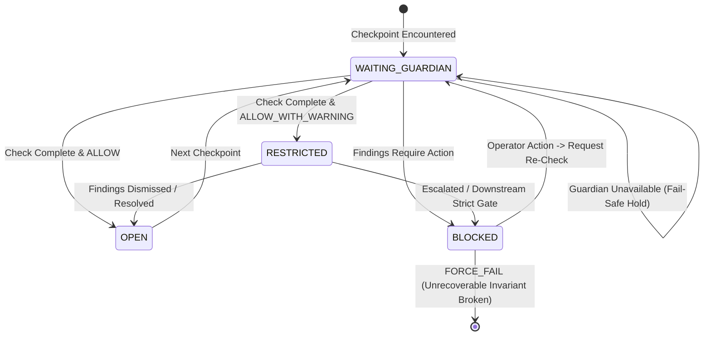
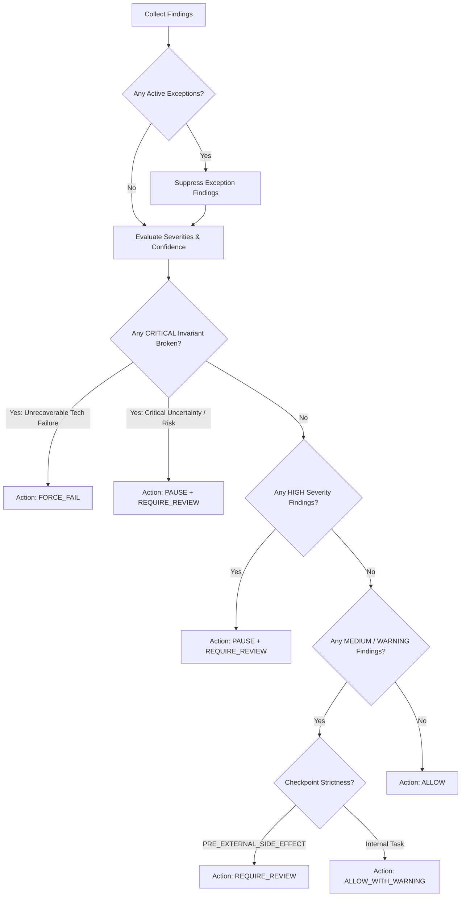
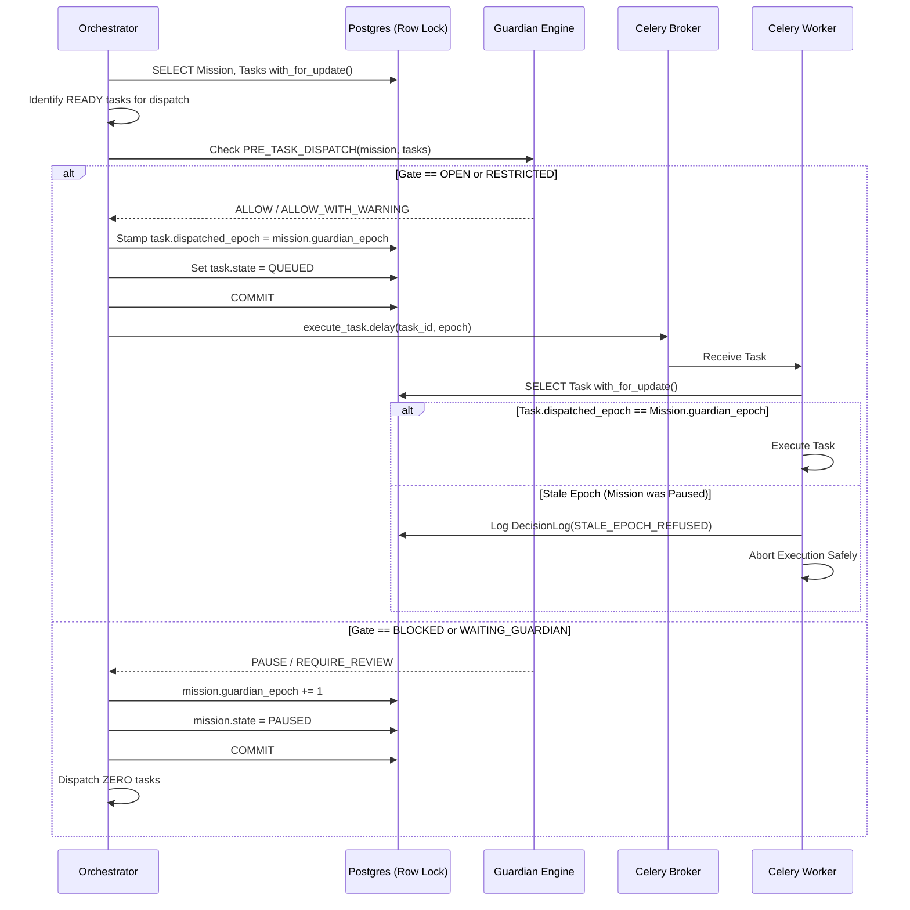
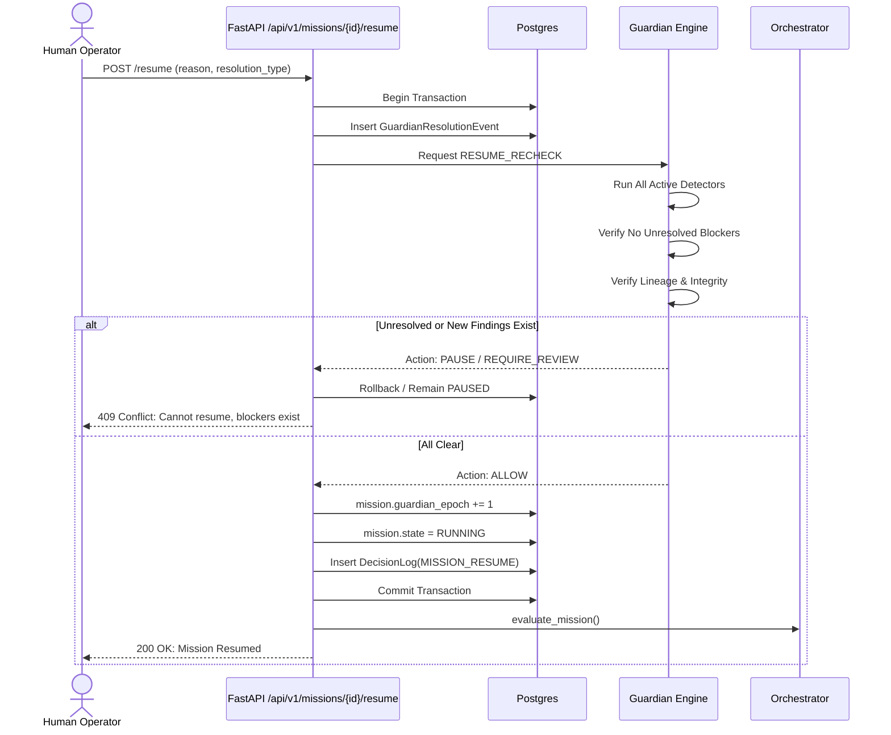
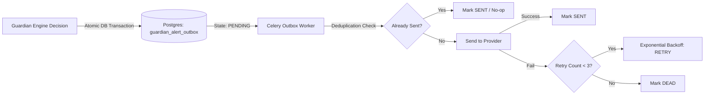
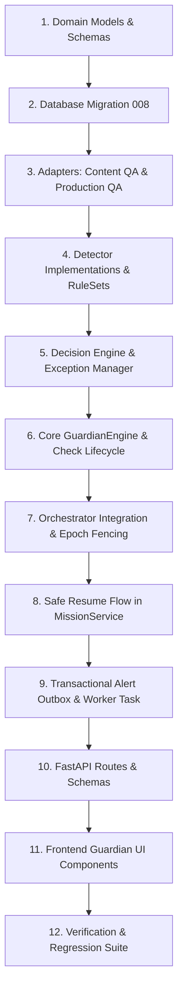

# Implementation Plan: OMEGA-008 — QA + Guardian

## 1. Executive Summary

OMEGA-008 establishes the **Guardian Subsystem**, the centralized safety, quality, policy, cost, and pipeline-risk control plane for the OMEGA Autonomous Content Operating System. 

Guardian operates on the foundational principle:
> **“Uncertainty → PAUSE / REQUIRE_REVIEW. Certainty of unrecoverable failure → FORCE_FAIL.”**

Prior to OMEGA-008, quality checks existed in domain-isolated silos: OMEGA-006 evaluated local script/statement rules (`Content QA`), and OMEGA-007 evaluated media packaging, encoding, and asset licensing (`Production QA`). However, the system lacked a unified gatekeeper to evaluate pipeline risks, enforce budget ceilings, guard against runaway retries or execution loops, prevent copyright violations, detect system infrastructure anomalies, and fence against concurrency races between async/sync orchestrators and distributed Celery workers.

Guardian introduces:
1. **Deterministic Gate Checkpoints**: Enforced before protected actions (`PRE_TASK_DISPATCH`, `PRE_RENDER`, `POST_RENDER`, `PRE_EXTERNAL_SIDE_EFFECT`, `MISSION_TERMINAL`).
2. **Immutable Audit Trail**: Append-only `GuardianFinding`, immutable `GuardianDecision`, and append-only `GuardianResolutionEvent` (no mutating findings or deleting history).
3. **Fencing Token Concurrency (`guardian_epoch`)**: Prevents race conditions where a task is dispatched just as an operator or detector triggers `PAUSE`.
4. **Authoritative QA Adapters**: Direct reuse of existing OMEGA-006 and OMEGA-007 rule engines without duplicating evaluation logic.
5. **Safe Resume Protocol**: Prohibits blind unpausing; every resume triggers an atomic re-check validating lineage, epoch, and newly discovered risks.
6. **Transactional Alert Outbox**: Reliable, deduplicated alerting (In-App and Telegram with deep links; strictly no insecure external command execution).

---

## 2. Existing Code Reuse & Integration Points

| Subsystem / Layer | Existing Component | OMEGA-008 Reuse / Integration Pattern |
| :--- | :--- | :--- |
| **OMEGA-002 Orchestrator** | [`orchestrator.py`](file:///c:/Users/User/OmegaContentEngine/backend/src/omega/application/orchestrator.py) (`evaluate_mission`, `evaluate_mission_sync`) | Before advancing `READY` tasks to `QUEUED` and calling `execute_task.delay()`, call Guardian `PRE_TASK_DISPATCH` check. If gate is `BLOCKED`, `PAUSED`, or `WAITING_GUARDIAN`, halt dispatch. |
| **OMEGA-002 Worker** | [`worker/tasks.py`](file:///c:/Users/User/OmegaContentEngine/backend/src/omega/worker/tasks.py) (`execute_task`) | Inspect `task.dispatched_epoch == mission.guardian_epoch` under row lock (`with_for_update()`). Stale workers refuse execution. |
| **OMEGA-002 Mission Service** | [`mission_service.py`](file:///c:/Users/User/OmegaContentEngine/backend/src/omega/application/mission_service.py) (`pause_mission`, `resume_mission`) | `pause_mission` increments `mission.guardian_epoch`. `resume_mission` is refactored to require safe re-check (`RESUME_RECHECK`) before unpausing. |
| **OMEGA-006 Content QA** | [`content_qa.py`](file:///c:/Users/User/OmegaContentEngine/backend/src/omega/application/content_qa.py) (`run_content_qa_checks`) | Wrapped via `ContentQAAdapter`. Translates `ScriptQAStatus` and rule codes (`FACTUAL_PROVENANCE_MISSING`, `FORBIDDEN_TOPIC_OR_TERM`, etc.) directly into `GuardianFinding` instances without re-implementing rules. |
| **OMEGA-007 Production QA** | [`production_qa.py`](file:///c:/Users/User/OmegaContentEngine/backend/src/omega/application/production_qa.py) (`ProductionQAEngine`) | Wrapped via `ProductionQAAdapter`. Translates `ProductionQAResult` and findings (ffprobe checks, stream mismatches, timeline gaps, asset license status) into `GuardianFinding` instances. |
| **OMEGA-007 Render Pipeline** | [`render_service.py`](file:///c:/Users/User/OmegaContentEngine/backend/src/omega/application/render_service.py) | Preserves authoritativeness: an artifact may be stored on disk even if QA is `BLOCKED`. Guardian `POST_RENDER` gate marks mission `RESTRICTED` or `PAUSED`, preventing downstream external side effects while preserving artifact for operator review. |
| **Database & Models** | [`models.py`](file:///c:/Users/User/OmegaContentEngine/backend/src/omega/infrastructure/models.py) | Add `guardian_epoch` to `Mission`, `dispatched_epoch` to `Task`, and declarative tables for Guardian entities. |

---

## 3. Domain Model

The Guardian domain model resides in `backend/src/omega/domain/guardian.py` with zero infrastructure dependencies.



### Domain Enumerations
- **`GuardianCheckpoint`**: `PRE_TASK_DISPATCH`, `PRE_RENDER`, `POST_RENDER`, `PRE_EXTERNAL_SIDE_EFFECT`, `MISSION_TERMINAL`.
- **`GuardianGateState`**: `OPEN` (proceed), `RESTRICTED` (proceed with warnings/monitoring), `BLOCKED` (cannot proceed), `WAITING_GUARDIAN` (fail-safe hold).
- **`GuardianAction`**: `ALLOW`, `ALLOW_WITH_WARNING`, `PAUSE`, `REQUIRE_REVIEW`, `FORCE_FAIL`.
- **`GuardianSeverity`**: `INFO`, `LOW`, `MEDIUM`, `HIGH`, `CRITICAL`.
- **`GuardianRiskType`**: `CONTENT_QUALITY`, `POLICY_VIOLATION`, `COPYRIGHT_LICENSE`, `MEDIA_CORRUPTION`, `COST_OVERRUN`, `SYSTEM_UNHEALTHY`, `PIPELINE_RUNAWAY`.
- **`DetectorFailurePolicy`**: `FAIL_OPEN_WITH_WARNING`, `FAIL_CLOSED`, `REQUIRE_REVIEW`.
- **`CheckTriggerType`**: `PRE_TASK_DISPATCH`, `PRE_RENDER`, `POST_RENDER`, `PRE_EXTERNAL_SIDE_EFFECT`, `MISSION_TERMINAL`, `RESUME_RECHECK`, `MANUAL`, `API`.
- **`GuardianResolutionType`**: `OVERRIDE_APPROVED`, `EXCEPTION_APPLIED`, `RETRY_REQUESTED`, `FALSE_POSITIVE_DISMISSED`, `MITIGATED`, `TERMINAL_ACCEPTED`.
- **`AlertChannel`**: `IN_APP`, `TELEGRAM`, `EMAIL`.
- **`AlertOutboxStatus`**: `PENDING`, `SENT`, `FAILED`, `RETRY`, `DEAD`.
- **`CostType`**: `LLM_TOKEN`, `TTS`, `COMPUTE_RENDER`, `MEDIA_STORAGE`, `EXTERNAL_API`.

---

## 4. Database Schema & Migration Plan (008)

Migration `008_create_guardian_tables.py` will branch from `down_revision = "007"`.

### Table Definitions & Constraints

```sql
-- 1. Alter missions table to add guardian_epoch
ALTER TABLE missions ADD COLUMN guardian_epoch INTEGER NOT NULL DEFAULT 1;

-- 2. Alter tasks table to add dispatched_epoch
ALTER TABLE tasks ADD COLUMN dispatched_epoch INTEGER NULL;

-- 3. guardian_rulesets
CREATE TABLE guardian_rulesets (
    id UUID PRIMARY KEY DEFAULT gen_random_uuid(),
    version VARCHAR(50) NOT NULL UNIQUE,
    status VARCHAR(50) NOT NULL DEFAULT 'DRAFT',
    effective_at TIMESTAMPTZ NOT NULL,
    checksum VARCHAR(64) NOT NULL,
    rules_config JSONB NOT NULL DEFAULT '{}'::jsonb,
    created_at TIMESTAMPTZ NOT NULL DEFAULT NOW()
);
CREATE INDEX ix_guardian_rulesets_status ON guardian_rulesets(status);

-- 4. guardian_checks
CREATE TABLE guardian_checks (
    id UUID PRIMARY KEY DEFAULT gen_random_uuid(),
    mission_id UUID NOT NULL REFERENCES missions(id) ON DELETE CASCADE,
    task_id UUID NULL REFERENCES tasks(id) ON DELETE SET NULL,
    production_request_id UUID NULL REFERENCES production_requests(id) ON DELETE SET NULL,
    media_artifact_id UUID NULL REFERENCES media_artifacts(id) ON DELETE SET NULL,
    trigger_type VARCHAR(50) NOT NULL,
    checkpoint VARCHAR(50) NOT NULL,
    ruleset_version VARCHAR(50) NOT NULL,
    status VARCHAR(50) NOT NULL DEFAULT 'PENDING',
    idempotency_key VARCHAR(255) NOT NULL,
    guardian_epoch INTEGER NOT NULL,
    diagnostic_context JSONB NOT NULL DEFAULT '{}'::jsonb,
    started_at TIMESTAMPTZ NOT NULL DEFAULT NOW(),
    completed_at TIMESTAMPTZ NULL,
    created_at TIMESTAMPTZ NOT NULL DEFAULT NOW(),
    CONSTRAINT uq_guardian_check_idempotency UNIQUE (mission_id, checkpoint, idempotency_key)
);
CREATE INDEX ix_guardian_checks_mission ON guardian_checks(mission_id, created_at DESC);
CREATE INDEX ix_guardian_checks_checkpoint ON guardian_checks(checkpoint, status);

-- 5. guardian_findings (Append-only / immutable)
CREATE TABLE guardian_findings (
    id UUID PRIMARY KEY DEFAULT gen_random_uuid(),
    guardian_check_id UUID NOT NULL REFERENCES guardian_checks(id) ON DELETE CASCADE,
    detector_type VARCHAR(100) NOT NULL,
    detector_version VARCHAR(50) NOT NULL,
    rule_id VARCHAR(100) NOT NULL,
    severity VARCHAR(50) NOT NULL,
    risk_type VARCHAR(100) NOT NULL,
    confidence FLOAT NOT NULL DEFAULT 1.0,
    evidence JSONB NOT NULL DEFAULT '{}'::jsonb,
    location_reference JSONB NOT NULL DEFAULT '{}'::jsonb,
    message TEXT NOT NULL,
    created_at TIMESTAMPTZ NOT NULL DEFAULT NOW()
);
CREATE INDEX ix_guardian_findings_check ON guardian_findings(guardian_check_id);
CREATE INDEX ix_guardian_findings_rule_severity ON guardian_findings(rule_id, severity);
CREATE INDEX ix_guardian_findings_risk_type ON guardian_findings(risk_type);

-- 6. guardian_decisions (Immutable decision event)
CREATE TABLE guardian_decisions (
    id UUID PRIMARY KEY DEFAULT gen_random_uuid(),
    guardian_check_id UUID NOT NULL REFERENCES guardian_checks(id) ON DELETE CASCADE,
    action VARCHAR(50) NOT NULL,
    reason TEXT NOT NULL,
    resulting_gate_state VARCHAR(50) NOT NULL,
    actor VARCHAR(100) NOT NULL DEFAULT 'GUARDIAN_ENGINE',
    created_at TIMESTAMPTZ NOT NULL DEFAULT NOW()
);
CREATE INDEX ix_guardian_decisions_check ON guardian_decisions(guardian_check_id);
CREATE INDEX ix_guardian_decisions_action ON guardian_decisions(action);

-- 7. guardian_decision_findings (Join table)
CREATE TABLE guardian_decision_findings (
    decision_id UUID NOT NULL REFERENCES guardian_decisions(id) ON DELETE CASCADE,
    finding_id UUID NOT NULL REFERENCES guardian_findings(id) ON DELETE RESTRICT,
    PRIMARY KEY (decision_id, finding_id)
);

-- 8. guardian_resolution_events (Append-only audit)
CREATE TABLE guardian_resolution_events (
    id UUID PRIMARY KEY DEFAULT gen_random_uuid(),
    finding_id UUID NULL REFERENCES guardian_findings(id) ON DELETE SET NULL,
    decision_id UUID NULL REFERENCES guardian_decisions(id) ON DELETE SET NULL,
    resolution_type VARCHAR(50) NOT NULL,
    actor VARCHAR(100) NOT NULL,
    reason TEXT NOT NULL,
    created_at TIMESTAMPTZ NOT NULL DEFAULT NOW()
);
CREATE INDEX ix_guardian_resolutions_finding ON guardian_resolution_events(finding_id);
CREATE INDEX ix_guardian_resolutions_decision ON guardian_resolution_events(decision_id);

-- 9. guardian_exceptions
CREATE TABLE guardian_exceptions (
    id UUID PRIMARY KEY DEFAULT gen_random_uuid(),
    rule_id VARCHAR(100) NULL,
    risk_type VARCHAR(100) NULL,
    channel_id UUID NULL REFERENCES channels(id) ON DELETE CASCADE,
    mission_id UUID NULL REFERENCES missions(id) ON DELETE CASCADE,
    expires_at TIMESTAMPTZ NOT NULL,
    actor VARCHAR(100) NOT NULL,
    reason TEXT NOT NULL,
    is_active BOOLEAN NOT NULL DEFAULT TRUE,
    created_at TIMESTAMPTZ NOT NULL DEFAULT NOW()
);
CREATE INDEX ix_guardian_exceptions_active ON guardian_exceptions(is_active, expires_at);

-- 10. guardian_alert_outbox
CREATE TABLE guardian_alert_outbox (
    id UUID PRIMARY KEY DEFAULT gen_random_uuid(),
    guardian_check_id UUID NOT NULL REFERENCES guardian_checks(id) ON DELETE CASCADE,
    decision_id UUID NOT NULL REFERENCES guardian_decisions(id) ON DELETE CASCADE,
    channel VARCHAR(50) NOT NULL,
    destination VARCHAR(255) NOT NULL,
    payload JSONB NOT NULL,
    dedupe_key VARCHAR(255) NOT NULL,
    status VARCHAR(50) NOT NULL DEFAULT 'PENDING',
    retry_count INTEGER NOT NULL DEFAULT 0,
    max_retries INTEGER NOT NULL DEFAULT 3,
    last_error TEXT NULL,
    scheduled_at TIMESTAMPTZ NOT NULL DEFAULT NOW(),
    sent_at TIMESTAMPTZ NULL,
    created_at TIMESTAMPTZ NOT NULL DEFAULT NOW(),
    CONSTRAINT uq_guardian_alert_dedupe UNIQUE (dedupe_key)
);
CREATE INDEX ix_guardian_alert_status ON guardian_alert_outbox(status, scheduled_at);

-- 11. cost_records
CREATE TABLE cost_records (
    id UUID PRIMARY KEY DEFAULT gen_random_uuid(),
    mission_id UUID NOT NULL REFERENCES missions(id) ON DELETE CASCADE,
    task_id UUID NULL REFERENCES tasks(id) ON DELETE SET NULL,
    production_request_id UUID NULL REFERENCES production_requests(id) ON DELETE SET NULL,
    cost_type VARCHAR(50) NOT NULL,
    amount_usd NUMERIC(10, 4) NOT NULL,
    units INTEGER NOT NULL DEFAULT 0,
    recorded_at TIMESTAMPTZ NOT NULL DEFAULT NOW(),
    created_at TIMESTAMPTZ NOT NULL DEFAULT NOW()
);
CREATE INDEX ix_cost_records_mission ON cost_records(mission_id);
CREATE INDEX ix_cost_records_type ON cost_records(cost_type);

-- 12. guardian_state_transitions
CREATE TABLE guardian_state_transitions (
    id UUID PRIMARY KEY DEFAULT gen_random_uuid(),
    mission_id UUID NOT NULL REFERENCES missions(id) ON DELETE CASCADE,
    checkpoint VARCHAR(50) NOT NULL,
    from_gate_state VARCHAR(50) NOT NULL,
    to_gate_state VARCHAR(50) NOT NULL,
    decision_id UUID NOT NULL REFERENCES guardian_decisions(id) ON DELETE CASCADE,
    guardian_epoch INTEGER NOT NULL,
    reason TEXT NOT NULL,
    created_at TIMESTAMPTZ NOT NULL DEFAULT NOW()
);
CREATE INDEX ix_guardian_transitions_mission ON guardian_state_transitions(mission_id, created_at);
```

---

## 5. Guardian Gate State Machine

The gate state determines whether execution can advance past a boundary checkpoint.



### Transition Invariants
1. **Protected Boundary Rule**: No task dispatch or render phase execution occurs while gate is `WAITING_GUARDIAN` or `BLOCKED`.
2. **Guardian Outage Behavior**: If the Guardian subsystem experiences a database timeout, Redis lock failure, or internal crash, the gate state remains `WAITING_GUARDIAN`. The mission enters a bounded pause for that specific gate—it **never** globally kills unaffected missions or blindly fails open across protected boundaries.
3. **Restricted Gate Operations**: An `OPEN` or `RESTRICTED` gate permits execution, but `RESTRICTED` logs warning telemetry and dispatches an in-app notice.

---

## 6. Detector Architecture

Every detector implements `BaseDetector` in `backend/src/omega/application/guardian/detectors/base.py`.

```python
class BaseDetector(ABC):
    detector_type: str
    detector_version: str
    supported_checkpoints: set[GuardianCheckpoint]
    failure_policy: DetectorFailurePolicy  # FAIL_CLOSED, REQUIRE_REVIEW, FAIL_OPEN_WITH_WARNING

    @abstractmethod
    async def evaluate(
        self,
        context: GuardianEvaluationContext,
        session: AsyncSession,
    ) -> list[GuardianFindingData]:
        """Evaluate context and return standardized findings."""
        pass
```

### Detector Families & Exception Behaviors

| Detector Family | Primary Target / Responsibilities | Supported Checkpoints | Failure Policy |
| :--- | :--- | :--- | :--- |
| **`ContentQualityDetector`** | Runs `ContentQAAdapter` to inspect script assertions, citations, forbidden terms, duration deviations, and structure. | `PRE_TASK_DISPATCH` (script tasks), `PRE_RENDER` | `REQUIRE_REVIEW` |
| **`PolicyRiskDetector`** | Evaluates explainable policy rules and copyright/licensing facts (provenance completeness, asset licensing validity). *No acoustic/video fingerprinting.* | `PRE_TASK_DISPATCH`, `PRE_RENDER`, `PRE_EXTERNAL_SIDE_EFFECT` | `FAIL_CLOSED` |
| **`MediaIntegrityDetector`** | Runs `ProductionQAAdapter` on media probe, disk existence, codec/dimension conformity, audio streams, and SHA-256 hashes. | `POST_RENDER` | `REQUIRE_REVIEW` |
| **`CostAnomalyDetector`** | Enforces hard ceiling and calculates rolling median cost anomalies for tasks/missions. | `PRE_TASK_DISPATCH`, `PRE_RENDER`, `MISSION_TERMINAL` | `FAIL_CLOSED` (hard ceiling) / `REQUIRE_REVIEW` (anomaly) |
| **`SystemHealthDetector`** | Inspects DB connection pool, Redis liveness, Celery queue backlog, and disk space threshold. | All Checkpoints | `FAIL_OPEN_WITH_WARNING` (advisory) / `FAIL_CLOSED` (disk full) |
| **`PipelineAnomalyDetector`** | Runaway protections: retry caps, max rerenders, consecutive provider failures, loop detection, timeout bounds. | `PRE_TASK_DISPATCH`, `PRE_RENDER`, `MISSION_TERMINAL` | `REQUIRE_REVIEW` |

---

## 7. Decision Engine

The Decision Engine takes the aggregate list of `GuardianFinding` instances, current checkpoint, mission risk context, active ruleset configuration, and active `GuardianException` entries to compute the final `GuardianDecision`.



### Core Principle Enforcement
- **CRITICAL ≠ Automatic FORCE_FAIL**: If a finding is `CRITICAL` due to an unverified factual claim or policy conflict, it results in `PAUSE` + `REQUIRE_REVIEW`.
- **FORCE_FAIL Criteria**: Restricted strictly to:
  1. Cryptographic hash or media byte corruption that cannot be regenerated.
  2. Complete loss of Channel DNA lineage invariants.
  3. Explicit human operator decision rejecting the mission permanently.
  4. Exhaustion of all bounded retries across all recovery strategies.

---

## 8. Orchestrator Integration

Integration occurs cleanly in both `evaluate_mission` (FastAPI async) and `evaluate_mission_sync` (Celery worker sync) in `backend/src/omega/application/orchestrator.py`.



### Integration Rules
1. **Zero Dispatches on Halt**: No Celery delay calls occur if the Guardian check does not return `ALLOW` or `ALLOW_WITH_WARNING`.
2. **Side Effect Fencing**: When a task has `requires_approval=True` or triggers external side effects, the checkpoint shifts to `PRE_EXTERNAL_SIDE_EFFECT` with stricter risk tolerance.
3. **Dangling Work Prevention**: In-flight tasks continue until natural completion or timeout; their completions cannot trigger downstream DAG dispatches while the mission is `PAUSED`.

---

## 9. Concurrency & Fencing Design

To guarantee absolute race safety between asynchronous web requests, background Celery orchestration, and parallel worker execution:

### 1. The `guardian_epoch` Fencing Token
- Every `Mission` has a monotonic integer column `guardian_epoch` (starts at 1).
- Any event that transitions a mission to `PAUSED`, applies a resolution override, or modifies gate state atomically executes:
  ```sql
  UPDATE missions SET guardian_epoch = guardian_epoch + 1, state = 'PAUSED', paused_at = NOW() WHERE id = :mission_id;
  ```
- When tasks are transitioned to `QUEUED`, they are stamped with `task.dispatched_epoch = mission.guardian_epoch`.
- When Celery worker `execute_task` begins execution:
  ```python
  task = session.query(Task).filter(Task.id == parsed_id).with_for_update().first()
  mission = session.query(Mission).filter(Mission.id == task.mission_id).first()
  if mission.state != MissionState.RUNNING.value or task.dispatched_epoch != mission.guardian_epoch:
      logger.warning("Stale worker epoch or paused mission. Refusing task execution.", 
                     task_id=str(task.id), task_epoch=task.dispatched_epoch, mission_epoch=mission.guardian_epoch)
      return {"status": "fenced_stale_epoch"}
  ```

### 2. Database Row Locking Boundaries
- All orchestrator DAG evaluations lock both `Mission` and `Task` rows using `.with_for_update()` in PostgreSQL.
- Short database transactions: long-running renders and FFmpeg operations execute out-of-transaction in staging directories; state transitions and Guardian evaluations happen in brief, locked transactions.

### 3. Check Idempotency
- Unique constraint `uq_guardian_check_idempotency` on `(mission_id, checkpoint, idempotency_key)` guarantees that duplicate Celery worker events or double HTTP clicks do not produce duplicate evaluations.

---

## 10. Safe Resume Flow

Resuming a mission is never a simple status flip. Resuming a paused mission must follow a strict, auditable re-check lifecycle:



---

## 11. QA Adapter Design

Existing rule engines are preserved as the authoritative sources of truth for their domains.

### 1. `ContentQAAdapter` (`backend/src/omega/application/guardian/adapters/content_qa_adapter.py`)
- Invokes `run_content_qa_checks` from `omega.application.content_qa`.
- Translates output:
  - `ScriptQAStatus.BLOCKED` → Evaluates each finding:
    - `FACTUAL_PROVENANCE_MISSING`, `BLOCKED_CLAIM_USED`, `FORBIDDEN_TOPIC_OR_TERM` → `severity = CRITICAL`, `risk_type = CONTENT_QUALITY`, `confidence = 1.0`.
    - `UNSUPPORTED_STATISTIC`, `UNSUPPORTED_QUOTE`, `OPEN_HIGH_RESEARCH_CONFLICT` → `severity = HIGH`.
  - `ScriptQAStatus.PASSED_WITH_WARNINGS` →
    - `DURATION_OUT_OF_BOUNDS`, `AVOIDED_VOCABULARY`, `DUPLICATE_OR_REPEATED_SECTION` → `severity = MEDIUM` or `LOW`.
  - Preserves exact statement order, section index, and citation identifiers in `evidence` and `location_reference`.

### 2. `ProductionQAAdapter` (`backend/src/omega/application/guardian/adapters/production_qa_adapter.py`)
- Invokes `ProductionQAEngine.evaluate` from `omega.application.production_qa`.
- Translates output:
  - `ProductionQASeverity.BLOCKING` →
    - `BLOCKED_ASSET_RIGHTS` → `severity = CRITICAL`, `risk_type = COPYRIGHT_LICENSE`.
    - `SCRIPT_PIN_MISMATCH`, `DNA_LINEAGE_MISMATCH` → `severity = CRITICAL`, `risk_type = PIPELINE_RUNAWAY`.
    - `RENDER_FILE_MISSING`, `RENDER_HASH_MISMATCH`, `ZERO_DURATION_ARTIFACT` → `severity = HIGH`, `risk_type = MEDIA_CORRUPTION`.
  - `ProductionQASeverity.WARNING` →
    - `SUBTITLE_EMPTY`, `SUBTITLE_OUT_OF_RANGE` → `severity = LOW`, `risk_type = MEDIA_CORRUPTION`.

---

## 12. Cost & Runaway Protection

### 1. Cost Engine (`CostAnomalyDetector`)
- **Hard Budget Ceiling**: Configured in active `GuardianRuleSet` (e.g., $10.00 max per mission, $50.00 max per channel/day).
  - Evaluated at `PRE_TASK_DISPATCH` and `PRE_RENDER`. If estimated or recorded cost exceeds ceiling → immediate `PAUSE` + `REQUIRE_REVIEW`.
- **Rolling Median Anomaly Detection**:
  - Minimum sample size: **>= 10 historical records** for the same channel and task type. If < 10 records exist, anomaly detection safely skips (prevents bootstrap false positives).
  - Metric: Rolling median $M$ of recorded task/render costs.
  - Threshold: Current task estimate > $2.0 \times M$ → triggers `REQUIRE_REVIEW` with warning finding.

### 2. Runaway Protections (`PipelineAnomalyDetector`)
Enforces hard limits configured in `GuardianRuleSet`:
- `max_retries_per_task`: Hard limit 3 (matches task model).
- `max_rerenders_per_production_request`: Hard limit 2.
- `max_tasks_per_mission`: Hard limit 50 tasks.
- `max_consecutive_provider_failures`: Hard limit 3.
- `max_task_runtime_seconds`: 600s (10 minutes).
- `max_mission_runtime_seconds`: 7200s (2 hours).
Breaching any limit halts the DAG, increments `guardian_epoch`, sets gate to `BLOCKED`, and marks mission `PAUSED`.

---

## 13. Transactional Alert Outbox

Alerts must never be lost due to network glitches or broker restarts.



### Channels Supported in OMEGA-008
1. **In-App**: Persisted in database and returned via `/api/v1/missions/{id}/guardian/status`.
2. **Telegram**:
   - Alert notifications only.
   - Message body includes: Mission title, gate state, trigger checkpoint, top findings (severity + rule ID), and deep link to authenticated frontend (`https://{host}/missions/{id}?tab=guardian`).
   - **Strictly Out-of-Scope**: No insecure Telegram inline buttons, webhooks, or unauthenticated resume commands.

---

## 14. API Design

All endpoints reside in `backend/src/omega/api/guardian.py` and are mounted under `/api/v1`.

### Mission-Scoped Endpoints
- `POST /api/v1/missions/{mission_id}/guardian/check`: Trigger on-demand evaluation at a specific checkpoint.
- `GET /api/v1/missions/{mission_id}/guardian/status`: Get current gate state, active epoch, latest decision, and unresolved findings.
- `GET /api/v1/missions/{mission_id}/guardian/findings`: List all historical findings for the mission (filterable by severity, checkpoint, detector).
- `GET /api/v1/missions/{mission_id}/guardian/history`: Chronological audit log of checks, decisions, gate transitions, and resolution events.

### Subsystem & Action Endpoints
- `GET /api/v1/guardian/checks/{check_id}`: Retrieve detailed check record, diagnostic context, and associated findings.
- `POST /api/v1/guardian/decisions/{decision_id}/resolve`: Operator resolution action.
  - Body: `{ resolution_type: str, actor: str, reason: str, finding_ids: list[UUID] }`.
  - Records `GuardianResolutionEvent`, executes `RESUME_RECHECK`, and transitions gate if clean.
- `GET /api/v1/guardian/rulesets`: List versioned rulesets.
- `POST /api/v1/guardian/rulesets`: Create a new ruleset version (draft).
- `POST /api/v1/guardian/exceptions`: Create a bounded audit exception (scoped by channel, mission, rule, and expiry).
- `GET /api/v1/guardian/exceptions`: List active exceptions.

---

## 15. Frontend Design

The frontend extends the Mission Detail page (`frontend/src/app/missions/[id]/page.tsx`) with a dedicated Guardian panel and tab.

### UI Components (`frontend/src/app/missions/[id]/guardian/`)
1. **`GuardianGateBadge.tsx`**:
   - Prominent header badge indicating `OPEN` (emerald), `RESTRICTED` (amber), `BLOCKED` (rose), or `WAITING_GUARDIAN` (purple/pulse).
   - Displays current `guardian_epoch` and last check timestamp.
2. **`GuardianFindingsList.tsx`**:
   - Grouped by severity (`CRITICAL`, `HIGH`, `MEDIUM`, `LOW`, `INFO`).
   - Cards display rule ID, detector type, confidence progress bar, concise message, expandable evidence JSON, and location references.
3. **`GuardianResolutionModal.tsx`**:
   - Interactive dialog allowing operators to resolve blockers.
   - Requires mandatory resolution reason, resolution type selection (`OVERRIDE_APPROVED`, `FALSE_POSITIVE_DISMISSED`, etc.), and initiates the safe re-check flow.
4. **`GuardianTimeline.tsx`**:
   - Chronological audit log showing gate transitions, checks, decisions, and resolution events with actor badges.
5. **`GuardianAlertBanner.tsx`**:
   - Dismissible warning banner shown whenever the gate is `RESTRICTED` or `WAITING_GUARDIAN`.

---

## 16. Proposed File & Module Locations

```
backend/
├── alembic/versions/
│   └── 008_create_guardian_tables.py           # Database migration for Guardian
├── src/omega/
│   ├── api/
│   │   ├── guardian.py                         # FastAPI routes for Guardian
│   │   └── router.py                           # Mount guardian router
│   ├── application/
│   │   ├── guardian/
│   │   │   ├── __init__.py
│   │   │   ├── engine.py                       # Core GuardianEngine
│   │   │   ├── decision_engine.py              # Decision logic & policy evaluation
│   │   │   ├── exceptions.py                   # Exception manager
│   │   │   ├── outbox.py                       # Alert outbox processor
│   │   │   ├── adapters/
│   │   │   │   ├── __init__.py
│   │   │   │   ├── content_qa_adapter.py       # Content QA adapter
│   │   │   │   └── production_qa_adapter.py    # Production QA adapter
│   │   │   └── detectors/
│   │   │       ├── __init__.py
│   │   │       ├── base.py                     # BaseDetector ABC
│   │   │       ├── content_quality.py          # Content quality detector
│   │   │       ├── policy_risk.py              # Policy risk & copyright facts detector
│   │   │       ├── media_integrity.py          # Media integrity detector
│   │   │       ├── cost_anomaly.py             # Cost ceiling & anomaly detector
│   │   │       ├── system_health.py            # Infrastructure health detector
│   │   │       └── pipeline_anomaly.py         # Runaway & retry bound detector
│   │   ├── orchestrator.py                     # Integrate Guardian gate checks
│   │   └── mission_service.py                  # Update pause & safe resume flow
│   ├── domain/
│   │   └── guardian.py                         # Guardian domain models, enums & schemas
│   ├── infrastructure/
│   │   └── models.py                           # SQLAlchemy models for Guardian tables
│   └── worker/
│       └── tasks.py                            # Celery task for alert outbox & epoch check
frontend/
├── src/
│   ├── app/missions/[id]/
│   │   ├── page.tsx                            # Integrate Guardian tab/panel
│   │   └── guardian/
│   │       ├── GuardianGateBadge.tsx
│   │       ├── GuardianFindingsList.tsx
│   │       ├── GuardianResolutionModal.tsx
│   │       └── GuardianTimeline.tsx
│   └── lib/
│       └── api.ts                              # Guardian TypeScript types and API client
```

---

## 17. Comprehensive Test Plan

Testing takes priority over arbitrary coverage metrics. The test suite will be structured across unit and integration suites:

### Unit Tests (`backend/tests/unit/`)
1. **`test_guardian_domain.py`**:
   - Validate immutability of `GuardianFinding` and `GuardianDecision`.
   - Validate valid gate state transitions and check status lifecycle.
2. **`test_guardian_decision_engine.py`**:
   - CRITICAL finding produces `PAUSE` + `REQUIRE_REVIEW`, **not** blind `FORCE_FAIL`.
   - Unrecoverable media/hash corruption correctly produces `FORCE_FAIL`.
   - Active scoped exception suppresses finding and yields `ALLOW`.
3. **`test_guardian_adapters.py`**:
   - `ContentQAAdapter`: Correct mapping of all 10 OMEGA-006 rule codes, severities, and citation metadata.
   - `ProductionQAAdapter`: Correct mapping of all 17 OMEGA-007 production QA rules.
   - Verify that rendered artifact with `BLOCKED` QA status creates `POST_RENDER` finding while preserving artifact reference.
4. **`test_guardian_detectors.py`**:
   - `PolicyRiskDetector`: Rule-based explainable violations; copyright provenance/licensing fact checks without fingerprinting.
   - `SystemHealthDetector`: DB/Redis failure behavior matches declared `failure_policy`.
5. **`test_guardian_cost_runaway.py`**:
   - Hard budget ceiling immediately halts check.
   - Cost anomaly detector: sample size < 10 returns no anomaly; sample size >= 10 with cost > 2x median flags anomaly.
   - Runaway protections: retry caps, rerender limits, and mission execution timeouts trigger findings.

### Integration Tests (`backend/tests/integration/`)
1. **`test_guardian_orchestrator_gates.py`**:
   - Orchestrator cannot dispatch `READY` tasks when `PRE_TASK_DISPATCH` gate is `BLOCKED` or `WAITING_GUARDIAN`.
   - Guardian unavailable/offline results in `WAITING_GUARDIAN`; mission does not fail open.
2. **`test_guardian_concurrency_fencing.py`**:
   - Pause vs. worker dispatch race: Dispatched Celery worker checks `task.dispatched_epoch == mission.guardian_epoch`; if pause incremented epoch, worker aborts cleanly without executing.
   - Concurrent `evaluate_mission` calls adhere to `with_for_update()` lock and idempotency keys.
3. **`test_guardian_safe_resume.py`**:
   - Resume requires full re-check.
   - Resume blocked if previous finding is resolved but a new finding is introduced.
   - Resume advances `guardian_epoch` and evaluates DAG.
4. **`test_guardian_alert_outbox.py`**:
   - Atomic insertion of alert with decision in same DB transaction.
   - Deduplication key prevents double sending.
   - Retry backoff on simulated failure; transition to `DEAD` after 3 retries.
5. **`test_guardian_api.py`**:
   - Mission status, findings filtering, check creation, and resolution endpoints.
   - Cross-channel / cross-mission access rejection.

---

## 18. Failure Modes & Mitigations

| Failure Mode | Impact | Mitigation Strategy |
| :--- | :--- | :--- |
| **Guardian DB / Redis Timeout during Check** | Orchestrator cannot obtain gate decision. | Gate state defaults to `WAITING_GUARDIAN`. Mission DAG execution pauses gracefully. Celery worker does not dispatch. System health alerts trigger. |
| **Worker Dispatch / Pause Race Condition** | Worker picks up task after operator or detector pressed PAUSE. | Stamped `dispatched_epoch` fails verification against incremented `mission.guardian_epoch` under row lock. Worker exits cleanly. |
| **Detector Throws Unhandled Exception** | Check execution interrupted mid-flight. | Detector execution wrapped in protected try-except. Applies declared detector `failure_policy`: `FAIL_CLOSED` for security/cost, `REQUIRE_REVIEW` for quality, `FAIL_OPEN_WITH_WARNING` for non-critical telemetry. |
| **Duplicate Celery Delivery of Guardian Check** | Multiple evaluations of same checkpoint. | Database unique constraint `(mission_id, checkpoint, idempotency_key)` rejects duplicate insert. Second worker exits cleanly. |
| **Operator Blind Unpause** | Workflow unpaused while underlying violation persists. | Safe resume protocol strictly enforces an atomic re-check before state transitions to `RUNNING`. Unresolved blockers prevent resume. |
| **Alert Destination Unavailable (e.g. Telegram API Down)** | Alert delivery fails. | Transactional outbox records failure, increments `retry_count`, and schedules exponential backoff. Alerts never disappear. |

---

## 19. Implementation Order



1. **Domain Layer**: Create `backend/src/omega/domain/guardian.py` with all enums, value objects, and Pydantic schemas.
2. **Infrastructure / Migration**: Update `backend/src/omega/infrastructure/models.py` with Guardian models and `guardian_epoch` / `dispatched_epoch` columns; generate migration `008_create_guardian_tables.py`.
3. **Adapters**: Implement `ContentQAAdapter` and `ProductionQAAdapter` to wrap existing rule engines cleanly.
4. **Detectors**: Implement `BaseDetector` and the 6 detector families (`ContentQuality`, `PolicyRisk`, `MediaIntegrity`, `CostAnomaly`, `SystemHealth`, `PipelineAnomaly`).
5. **Decision Engine & Exceptions**: Implement `GuardianDecisionEngine` with multi-factor risk assessment and `GuardianExceptionManager`.
6. **Engine Orchestration**: Implement `GuardianEngine` coordinating check execution, findings collection, decision generation, and state transitions.
7. **Orchestrator & Fencing**: Integrate `PRE_TASK_DISPATCH`, `PRE_RENDER`, `POST_RENDER`, `PRE_EXTERNAL_SIDE_EFFECT`, and `MISSION_TERMINAL` checks into `orchestrator.py`; update `execute_task` in `worker/tasks.py` with epoch fencing.
8. **Safe Resume**: Refactor `resume_mission` in `mission_service.py` to require the atomic re-check flow.
9. **Alert Outbox**: Implement `AlertOutboxService` and Celery background task `process_guardian_alert_outbox`.
10. **API Layer**: Implement `backend/src/omega/api/guardian.py` and register in `backend/src/omega/api/router.py`.
11. **Frontend Layer**: Implement Guardian types in `frontend/src/lib/api.ts` and Guardian UI components on the mission details page.
12. **Validation**: Execute unit tests, integration tests, Ruff formatting/linting, frontend build/lint, and full regression against OMEGA-001 through 007.

---

## 20. Definition of Done

OMEGA-008 will be considered **DONE** only when:
- [ ] Guardian checks are reproducible, idempotent, and audited.
- [ ] Findings are immutable; decisions are immutable; resolutions are append-only events.
- [ ] Detectors and rulesets are versioned with configuration checksums.
- [ ] Guardian gates protect all 5 workflow checkpoints.
- [ ] Orchestrator cannot dispatch protected work while in `PAUSED` or `WAITING_GUARDIAN` states.
- [ ] Pause vs. dispatch race conditions are eliminated via `guardian_epoch` fencing and tested.
- [ ] Stale worker execution rejection is verified.
- [ ] Safe resume protocol always executes an atomic re-check before resuming.
- [ ] `FORCE_FAIL` is strictly bounded to unrecoverable technical corruption or invariant violations; uncertainty results in `PAUSE` + `REQUIRE_REVIEW`.
- [ ] Existing Content QA (OMEGA-006) and Production QA (OMEGA-007) are reused through adapters without logic duplication.
- [ ] Cost hard ceilings and rolling median anomaly detection (sample size >= 10) are operational.
- [ ] Policy risk checks are explainable, rule-based, and copyright checks verify provenance/licensing facts only.
- [ ] Runaway protections (retries, rerenders, runtime caps) are operational.
- [ ] Transactional alert outbox processes In-App and Telegram notifications with deduplication and retry/dead states.
- [ ] In-app Guardian UI renders gate status, findings, timeline, and resolution workflows.
- [ ] Guardian outages fail safely at protected checkpoints into `WAITING_GUARDIAN`.
- [ ] Alembic migration `008` applies cleanly on top of `007` and rolls back without errors.
- [ ] All new and existing tests pass cleanly (`pytest tests/unit tests/integration`).
- [ ] Ruff check and Ruff format checks pass with zero errors.
- [ ] Frontend build and lint checks pass.
- [ ] Zero OMEGA-009+ features are included.

---

## 21. Explicit Out-of-Scope Items

To prevent scope creep and maintain architectural boundaries, the following are strictly deferred to future phases:
- **OMEGA-009**: Multi-channel distribution, social publishing schedules, platform API auth.
- **OMEGA-010**: Analytics ingestion, feedback loops, viewer retention metrics.
- **OMEGA-011**: Autonomous publishing execution and live YouTube/social handshakes (PRE_PUBLISH and POST_PUBLISH remain speculative extension points only).
- **Perceptual Fingerprinting / Acoustic Matching**: No audio waveform fingerprinting or video frame hashing against commercial copyright databases (only metadata/provenance license checks are within scope).
- **Interactive External Command Execution**: No Telegram bots executing approve/resume commands or webhook callbacks.
- **Multi-Tenant Corporate Billing**: No multi-currency billing, payment gateway integrations, or Phase 2 economics models.

---

## Important Transaction Boundaries & Unique Constraints

### Unique Constraints
1. `uq_guardian_check_idempotency`: `guardian_checks(mission_id, checkpoint, idempotency_key)`
2. `uq_guardian_decision_findings`: `guardian_decision_findings(decision_id, finding_id)`
3. `uq_guardian_alert_dedupe`: `guardian_alert_outbox(dedupe_key)`
4. `uq_guardian_ruleset_version`: `guardian_rulesets(version)`

### Transaction Boundaries
- **Check Evaluation & Gate Setting**: Atomic transaction covering `guardian_checks` insertion, detector evaluations, `guardian_findings` bulk insert, `guardian_decisions` insert, `guardian_alert_outbox` insert, and `missions.guardian_epoch` update (if state changes).
- **Task Dispatch**: Atomic transaction loading `Mission` and `Task` with `with_for_update()`, stamping `task.dispatched_epoch = mission.guardian_epoch`, committing, and only then invoking `execute_task.delay()`.
- **Worker Execution**: Initial atomic transaction locking `Task` and `Mission`, validating `dispatched_epoch == mission.guardian_epoch`, and transitioning `QUEUED -> RUNNING`. Execution happens outside DB transaction. Finalization locks `Task` and transitions `RUNNING -> SUCCEEDED/FAILED`.

---

## Design Questions & Decisions for Implementation

1. **Storage of Diagnostic Context**:
   - *Decision*: Stored as JSONB in `guardian_checks.diagnostic_context` for operator troubleshooting, explicitly declared non-authoritative.
2. **Epoch Increment Scope**:
   - *Decision*: `guardian_epoch` increments on any transition that halts, pauses, or overrides a mission, ensuring any task queued under an earlier state is invalidated immediately.
3. **Alert Outbox Processing Interval**:
   - *Decision*: Processed via Celery beat or Celery task scheduled every 10 seconds, with immediate triggering on high-severity decisions.
